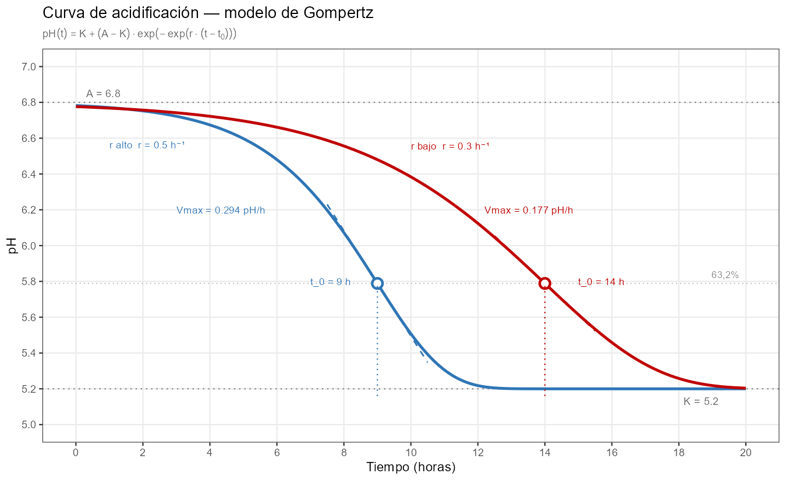
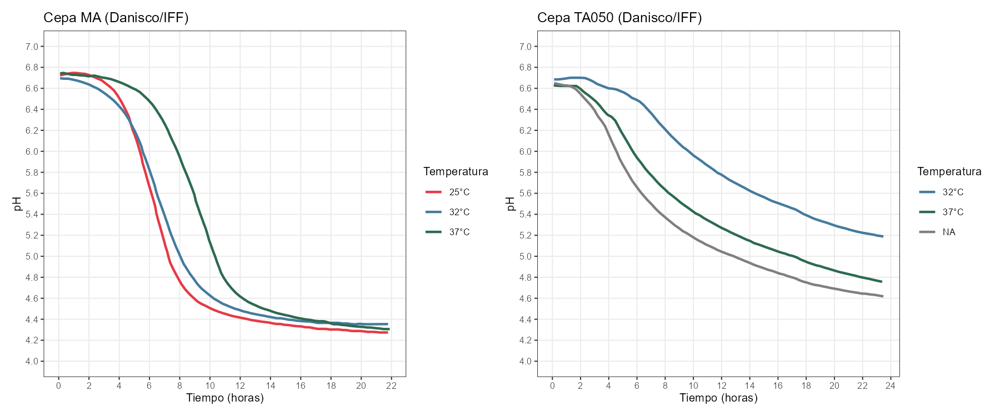
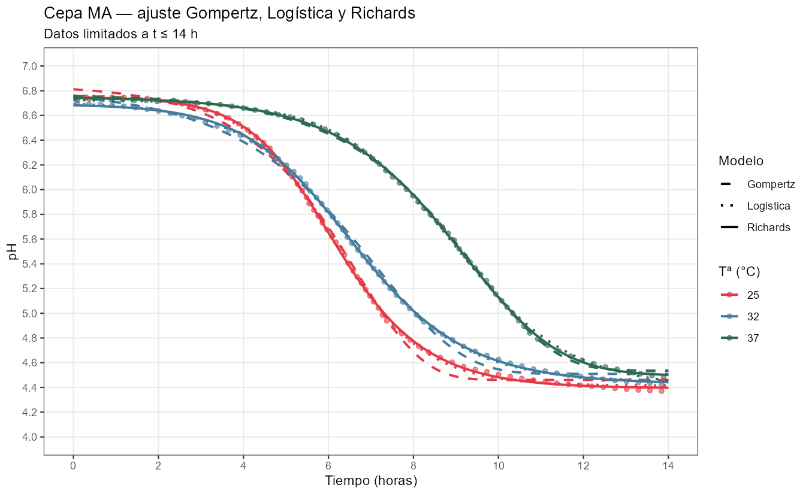

Hay un dato que todo quesero registra y pocos analizan con la profundidad que merece: la curva de descenso del pH durante la elaboración. Sin embargo, el perfil de descenso de esta curva y sus límites determinan el grado de desmineralización, que tiene una gran influencia en la textura final, y su conocimiento y manejo es una herramienta fundamental en el control de la textura del queso. 

La modelización matemática de las curvas de acidificación [@Mietton1994] tiene su base en el modelado de las curvas de crecimiento microbiano, un campo con raíces en los años noventa [@Zwietering1990; @Baranyi1994] que sigue siendo activo y relevante, tanto en microbiología predictiva como en seguridad alimentaria [@Dey2025]. En este artículo explico cómo aplicar esos conceptos a la curva de acidificación láctica en quesería, qué información extraemos de sus parámetros y cómo elegir entre modelos según los datos disponibles.

## Por qué la curva de acidificación importa más de lo que parece

Durante las primeras horas de elaboración, los fermentos lácticos convierten la lactosa en ácido láctico. El pH desciende desde \~6,8 en la leche hasta valores que en una pasta prensada se sitúan entre 5,1 y 5,4, y que en pastas blandas o quesos azules pueden llegar a 4,6–4,9. Este descenso no es solo un indicador de actividad bacteriana: controla tres procesos simultáneos con consecuencias tecnológicas directas.

El primero es la **desmineralización de la cuajada**. A medida que el pH desciende, el calcio coloidal asociado a la red de caseína se solubiliza y pasa al suero. La cuajada pierde rigidez progresivamente y adquiere las propiedades reológicas características del queso maduro. El grado total de desmineralización está determinado principalmente por $K$: cuanto más bajo sea el pH final, mayor es la solubilización del fosfato cálcico coloidal y mayor la pérdida de calcio unido a la caseína [@Fox2017; @Lucey1993]. Fox señala explícitamente que la tasa de acidificación  (el parámetro $r$ del modelo) afecta al grado de disolución del CCP y, con él, a las propiedades reológicas del queso [@Fox2017], pero la dirección exacta de ese efecto sobre la textura cuando $K$ es constante no está completamente establecida en la literatura y es objeto de investigación. Lo que sí está claro es que $K$ es la palanca principal: quesos con $K$ bajo (mayor acidificación) están más desmineralizados, tienen menos calcio insoluble unido a la caseína, y tienden a una textura más corta y friable; quesos con $K$ alto retienen más calcio coloidal y presentan texturas más elásticas y largas [@Fox2017]. En tecnologías de pasta blanda o queso azul, la acidificación más intensa ($K$ más bajo, en el rango 4,6–4,9) produce una desmineralización más completa que reduce la rigidez de la matriz de paracaseína y la hace más accesible a las enzimas proteolíticas, de modo que la desmineralización actúa como condición previa necesaria para la proteólisis primaria durante la maduración [@Lucey1993; @OMahony2005]. Este proceso proteolítico posterior producido por el hongo azul es el que favorece el desarrollo tanto de las texturas fundentes y cremosas como del sabor y aroma característicos de esas variedades.

El segundo proceso es el **control microbiológico**. La caída de pH es la barrera primaria contra patógenos como *Listeria monocytogenes*, *Staphylococcus aureus* o coliformes. La velocidad con que se alcanza el pH inhibidor es tan importante como el pH final: un arranque lento da tiempo a que la flora indeseable se establezca antes de que la acidez la frene [@Mietton1994]. Esto crea un dilema real entre textura y seguridad que analizaré más adelante.

El tercero es la **regulación de enzimas proteolíticas**. La quimosina residual del cuajo, la plasmina de la leche y las enzimas microbianas tienen actividades muy dependientes del pH. El perfil de acidificación determina en buena medida qué proteólisis ocurrirá durante la maduración, y con ella el desarrollo del sabor y la textura a largo plazo; por debajo de pH 5 la actividad proteolítica de estas enzimas se ralentiza, al alejarse de su óptimo de actividad, y sólo se produce en el caso de los azules o pastas blandas como resultado de la acción del *Penicillium* (sea *P. camemberti* o *P. roqueforti*). En esos casos, la proteólisis inducida por el hongo hace remontar el pH como consecuencia de la liberacion de amonio, y lo sitúa en el óptimo de actuación del resto de enzimas.

Para conocer y dominar el proceso es preciso conocer la curva entera, no solo el pH final. El ajuste del modelo a los datos experimentales permite estimar los parámetros de la curva a partir de los datos reales, lo que permite a su vez caracterizar la curva completa con pocos valores.

## Los modelos sigmoidales: una familia de curvas con parámetros biológicos

El descenso de pH durante la acidificación tiene una forma característica: arranca despacio desde el pH inicial de la leche, acelera cuando los fermentos alcanzan su máxima actividad, y se frena hasta estabilizarse en un pH final. Esa forma en S invertida (sigmoide) no es arbitraria: refleja la dinámica de una población bacteriana que crece, produce ácido y acaba inhibiéndose por el propio producto de su metabolismo y la falta de sustrato, que ha sido consumido en el crecimiento.

Los modelos sigmoidales [@wikipedia_logistic_function] parametrizan esa curva con un número reducido de parámetros, cada uno con interpretación directa en términos de proceso. Hay una familia de modelos relacionados entre sí por complejidad creciente. Los tres más utilizados en microbiología predictiva y tecnología quesera son la **logística estándar** [@wikipedia_funcion_logistica], el **modelo de Gompertz** y el **modelo de Richards**. Los tres comparten los parámetros de escala — pH inicial, pH final, tiempo de inflexión, velocidad máxima — pero difieren en cómo sitúan el punto de inflexión de la curva y en cuánta libertad dan al ajuste para adaptarse a la asimetría real de los datos. 

Existe un cuarto modelo, el de **Baranyi** [@Baranyi1994], que incorpora una fase de latencia explícita en el arranque; sin embargo, su parámetro adicional solo es estimable con datos densos en la zona de pH inicial plana, cobertura que raramente se alcanza con el protocolo habitual de medida en producción. En esta zona inicial es necesario recoger muchas medidas de pH cuando apenas ha arrancado la acidificación y las diferencias de valor están en el límite de lo detectable por el pHmetro, lo que hace que la precisión analítica del instrumento de medida pueda condicionar los resultados. Además, el modelo de Baranyi es sensible al número y distribución de los datos: en comparaciones directas con otros modelos, no converge o requiere fijar parámetros cuando los datos son escasos o mal distribuidos [@Buchanan1997].

### La logística estándar: cuatro parámetros, inflexión al 50%

El modelo logístico estándar es el punto de partida natural. Describe el descenso del pH como:

$$\text{pH}(t) = K + \frac{A - K}{1 + \exp\!\bigl(r \cdot (t - t_i)\bigr)}$$

Cuatro parámetros, cada uno con significado tecnológico directo:

**$A$** (a veces referido como $pH_{ini}$) es el pH inicial, en el momento de inocular los fermentos. Refleja el estado de la leche, su carga microbiana, su historial de refrigeración, su acidez de partida o sus tratamientos previos (incluyendo la premaduración). Fabricaciones con A sistemáticamente distinto entre lotes son una señal de irregularidad en la materia prima o de diferente manejo.

**$K$** (a veces referido como $pH_{fin}$) es el pH final al que converge la curva: la asíntota inferior, el pH al que llegará la cuajada al término de la acidificación activa. Es el parámetro tecnológicamente más relevante porque determina el grado total de desmineralización y, con él, la textura y el comportamiento del queso en maduración. En determinadas tecnologías de pasta prensada, K entre 5,25 y 5,35 indica una acidificación correcta; por encima de 5,35, acidificación incompleta; por debajo de 5,25, sobreacidificación. En otras tecnologías, estos valores pueden cambiar, pero la interpretación respecto a los valores de referencia es similar. Una $K$ anormalmente alta acompañada de $V_{max}$ baja es una señal de alerta: puede indicar bloqueo del fermento por fagos, inhibidores en la leche (antibióticos, residuos de detergentes) o competencia con flora contaminante. Conviene tener presente que una $K$ elevada no siempre refleja un fermento lento; puede ser consecuencia de una alta capacidad tampón de la leche (por concentración mediante ultrafiltración, alto contenido en caseína o calcio coloidal elevado), que frena el descenso de pH con independencia de la actividad bacteriana [@McSweeney2007; @Mietton1994]. Distinguir ambas causas requiere comparar $K$ con la tasa de producción de ácido láctico, no solo con el pH.

**$t_i$**(también referido en la bibliografía como $t_0$ o $x_0$) es el tiempo en que ocurre la máxima velocidad de descenso: el punto de inflexión de la sigmoide. En el modelo logístico, este punto se sitúa exactamente al 50% del descenso total, es decir, cuando $pH(tᵢ) = K + (A − K)/2$. Es el parámetro más útil para la planificación del proceso: anticipa cuándo llegará la fase de máxima actividad bacteriana y permite programar el moldeo, el prensado y la entrada en salmuera con criterio.

**$r$** controla la pendiente general de la curva,es decir, la brusquedad del descenso. Una $r$ alta produce una curva muy inclinada que indica un descenso muy rápido; una $r$ baja, una caída lenta y prolongada.

De $r$ se deriva el parámetro más útil para comparar fabricaciones: **$V_{max}$**, la velocidad máxima de descenso del pH, que es la velocidad en el punto de inflexión $t_i$. En el modelo logístico, la expresión es especialmente sencilla:

$$V_{max} = \frac{r \cdot (A - K)}{4}$$

Es la métrica correcta para comparar entre lotes o entre cepas la intensidad de la acidificación, independientemente del pH inicial o final.


Las dos curvas alcanzan el mismo $K$ (5,20), el mismo grado total de desmineralización al final del proceso. Lo que difiere es el tiempo que la cuajada pasa a cada pH intermedio durante el recorrido. El punto de inflexión se sitúa exactamente al 50% del descenso total, una restricción intrínseca del modelo logístico.

### El modelo de Gompertz: la misma parsimonia, otra posición de inflexión

El modelo de Gompertz invertido describe el descenso del pH con la misma estructura de cuatro parámetros, pero con una geometría diferente:

$$\text{pH}(t) = K + (A - K) \cdot \exp\!\bigl(-\exp(r \cdot (t - t_i))\bigr)$$

Los parámetros $A$, $K$, $t_i$ y $r$ tienen exactamente el mismo significado tecnológico que en la logística. La diferencia es estructural: en Gompertz, el punto de inflexión ocurre en $t_i$ — igual que en todos los modelos de esta familia — pero en ese instante se ha completado el **63,2%** del descenso total ($= 1 − 1/e$). Esto implica que la curva de Gompertz es asimétrica: la caída antes de $t_i$ es lenta y prolongada, y la aceleración se concentra en el tramo final hasta $K$. Gompertz asume implícitamente ese perfil para cualquier cepa, sin posibilidad de ajuste.

La expresión de Vmax en Gompertz incorpora el factor $1/e$:

$$V_{max} = \frac{r \cdot (A - K)}{e}$$

Una advertencia importante de comparabilidad: **$r$ y $V_´max} no son comparables directamente entre modelos**. Para los mismos datos, la logística estima siempre un $r$ mayor que Gompertz ($r_{logística} ≈ 1,5–1,7 × r_{Gompertz}$), porque ambos parámetros tienen escalas internas distintas. $K$, en cambio, es prácticamente idéntico entre modelos para los mismos datos: diferencias de 0,01–0,02 unidades, tecnológicamente irrelevantes. $K$ puede compararse libremente entre modelos; $r$ y $V_{max}$, no.



Comparando ambas figuras, la diferencia de asimetría es visible: la curva de Gompertz tiene una fase inicial más plana y concentra la caída en la segunda mitad del descenso. En muchas cepas lácticas ese perfil no describe bien la realidad — el fermento alcanza su máxima actividad relativamente pronto, con una caída inicial rápida seguida de una larga cola. Esa asimetría inversa es exactamente lo que Gompertz no puede representar, porque la proporción del 63,2% completada en $t_i$ es una constante matemática intrínseca al modelo, no un parámetro ajustable.

Gompertz lleva más de tres décadas siendo el estándar en microbiología predictiva desde el trabajo fundacional de Zwietering et al. (1990) [@Zwietering1990], pero conviene precisar el contexto: esa literatura lo aplica a curvas de **crecimiento** bacteriano, que tienen una dinámica opuesta a la acidificación: fase lag larga, aceleración tardía y autolimitación brusca al agotar el sustrato. Esa forma, con el 63,2% del recorrido completado en $t_i$, describe bien el crecimiento pero no la acidificación láctica, donde el fermento arranca con actividad alta y se frena de forma progresiva. Los datos de ajuste de las cepas Danisco/IFF, que veremos más adelante, confirman empíricamente que la logística supera a Gompertz en cinco de los seis casos con los mismos cuatro parámetros.

### El modelo de Richards: el quinto parámetro que describe la asimetría

El modelo de Richards parametrizado por tiempo de inflexión generaliza a los dos anteriores añadiendo un único parámetro adicional, ν, que controla la **asimetría** de la curva alrededor del punto de inflexión:

$$\text{pH}(t) = K + (A - K) \cdot \bigl(1 + \nu \cdot \exp\!\bigl(r \cdot (t - t_i)\bigr)\bigr)^{-1/\nu}$$

En esta parametrización, **$t_i$ es siempre el tiempo en el que ocurre la máxima velocidad de descenso**, independientemente de $\nu$ — es un parámetro con significado biológico directo y observable en el gráfico antes de ajustar el modelo. Lo que $\nu$ controla es la fracción del descenso total completada en ese instante, es decir, la asimetría de la curva a cada lado de $t_i$:

- **$\nu → 0$**: el modelo converge a Gompertz. En $t_i$ se ha completado el 63,2% del descenso. La curva tiene arranque lento y caída concentrada en la segunda mitad; la mayor parte del descenso ocurre *después* del momento de máxima velocidad.
- **$\nu = 1$**: la expresión se reduce a la logística estándar. En $t_i$ se ha completado el 50%. La curva es simétrica.
- **$\nu > 1$**: en $t_i$ se ha completado menos del 50% del descenso. La curva tiene arranque rápido y una larga cola de inhibición — la mayor parte del descenso ocurre *antes* del momento de máxima velocidad.

Ese tercer perfil ($\nu > 1$) describe la estrategia metabólica más habitual en cepas lácticas: acidificación agresiva inicial que se frena progresivamente por acumulación de lactato e inhibición por pH. Gompertz asume el perfil opuesto para todas las cepas, sin posibilidad de corrección.

Es importante distinguir qué controla cada parámetro y qué variables de proceso pueden modificarlo. **$r$ y $t_i$** son sensibles a las condiciones de trabajo: aumentar la temperatura de cuba incrementa $r$, lo que adelanta $t_i$ y eleva $V_{max}$. La dosis de inoculación actúa de forma diferente y más compleja. 

Lo que la observación empírica muestra [@Mietton1994] es que la $V_{max}$ (la pendiente máxima en $t_i$) se mantiene aproximadamente constante al variar la dosis para la misma cepa y temperatura: doblar la dosis equivale a ganar aproximadamente un tiempo de generación bacteriana, adelantando el momento de máxima actividad sin modificar su intensidad. 

Este comportamiento tiene respaldo en la literatura de microbiología predictiva: en comparaciones directas entre modelos ajustados a distintas concentraciones de inóculo, la tasa de crecimiento intrínseca de la cepa (el parámetro $r$ en nuestro contexto, que juega el papel análogo al $\mu$ de la literatura de crecimiento bacteriano [@Buchanan1997] aunque aplicado a un proceso de descenso en lugar de crecimiento) permanece aproximadamente constante, mientras que la duración de la fase de latencia disminuye al aumentar la concentración del inóculo. La dosis también puede afectar a $K$: una mayor concentración de fermentos incrementa la actividad acidificante total y puede desplazar el equilibrio entre producción de ácido láctico y capacidad tampón del medio hacia un pH final más bajo [@Mietton1994]. 

La capacidad tampón de la leche, que depende de su contenido en proteínas, calcio coloidal y fosfatos, actúa como freno sobre el descenso de pH; cuando la actividad acidificante supera esa capacidad tampón, $K$ desciende. La forma de la curva cambia con la dosis: con dosis alta el arranque es más brusco (la fase de latencia es más corta y la transición hacia la caída activa más abrupta); con dosis baja el arranque es más gradual. Solo en la zona central alrededor de $t_i$ las curvas son verdaderamente paralelas [@Mietton1994]. 

Los modelos sigmoidales de cuatro o cinco parámetros describen bien cada curva individualmente una vez ajustada, pero no capturan analíticamente cómo cambia la forma completa de la curva con la dosis; para eso es necesario un modelo con fase de latencia explícita, como el modelo de Baranyi [@Baranyi1994; @Buchanan1997]. **$\nu$**, en cambio, es una característica intrínseca de la cepa: describe cómo distribuye su actividad a lo largo del descenso, independientemente de la escala temporal. Dos lotes del mismo fermento a distinta temperatura tendrán $t_i$ y $V_{max}$ diferentes pero un $\nu$ similar; dos cepas distintas con el mismo $t_i$ y la misma $V_{max}$ pueden tener $\nu$ muy distintos y producir perfiles de textura diferentes, con consecuencias organolépticas que los parámetros básicos no capturan.


El coste de Richards es claro: un parámetro adicional necesita datos adicionales para estimarse de forma estable. Con menos de 10 puntos bien distribuidos entre el arranque, la caída activa y el talón, $\nu$ tiende a ser inestable y el modelo no añade información real sobre la logística o Gompertz. Con datos densos (12 o más puntos con buena cobertura de las tres zonas), Richards puede discriminar comportamientos que los modelos de cuatro parámetros no distinguen.

![Efecto del parámetro ν en el modelo de Richards parametrizado por tiempo de inflexión. Las tres curvas comparten A, K, r y tᵢ = 10 h. Los círculos marcan el punto de inflexión, que siempre ocurre en tᵢ para los tres valores de ν. Lo que cambia es el pH en ese instante — es decir, la fracción del descenso ya completada — y con ello la forma de la curva a cada lado: ν = 0,5 concentra la caída después de tᵢ (55,6% completado); ν = 1,0 es simétrica (50%); ν = 1,5 concentra la caída antes de tᵢ (45,7% completado, arranque rápido).](imagenes/03-mod-richards-nu.png)


### El modelo de Baranyi

Baranyi y Roberts [-@Baranyi1994] desarrollaron en 1994 un modelo para curvas de crecimiento bacteriano que incorpora la fase lag de forma matemáticamente rigurosa. Su comparación con los modelos de Gompertz y un modelo lineal trifásico más simple [@Buchanan1997] mostró que los tres modelos proporcionan ajustes similares con datos densos, pero difieren en robustez cuando los datos son escasos, resultado análogo al que observamos para la acidificación quesera. El concepto central del modelo de Baranyi es el **tiempo fisiológico** $F(t)$: el tiempo que ha experimentado realmente la célula en términos de actividad metabólica, el "trabajo" que las bacterias todavía necesitan hacer antes de entrar en fase exponencial plena.

Para indicar este *tiempo fisiologico*, el modelo de Baranyi añade un parámetro ($h_0$) que indica este *retraso fisiológico* o *lag* antes de entrar en la fase exponencial. Para estimarlo de forma estable se necesita un número de datos suficiente en la fase de latencia, lo que con el protocolo habitual de medida en quesería (pocas medidas antes de que la acidificación sea detectable) es posible que no se registre adecuadamente. A esta dificultad hay que añadir que las variaciones entre diferentes curvas en la fase de latencia son tan bajas que pueden estar por debajo del nivel de error del pHmetro de producción. En estos casos, $h_0$ puede ser inestable o no identificable. 

La curva de pH, según este modelo, se expresa como 

$$\text{pH}(t) = K + \frac{A - K}{1 + \exp\!\bigl(r \cdot (F(t) - t_0)\bigr)}$$

Con $h_0 = 0$, $F(t) = t$ y la expresión se reduce exactamente a la logística estándar. Con $h_0 > 0$, la curva tiene una zona inicial más plana que se une suavemente a la caída sigmoide.

El cálculo detallado del modelo y la explicación de la estimación de $F(t)$ requiere un desarrollo que va más allá de este documento, pero que se pueden implementar en R sin demasiada dificultad.

La velocidad máxima de descenso $V_{max}$ es la misma que en la logística:

$$V_{max} = \frac{r \cdot (A - K)}{4}$$

Esto quiere decir que **$V_{max}$ no depende de $h_0$**. La dosis de inoculación, que controla $h_0$, modifica el momento en que ocurre la máxima velocidad pero no su valor. La velocidad intrínseca de la cepa en esas condiciones es independiente de cuántas bacterias se añadieron al inicio.


El resultado del modelo reproduce exactamente el patrón explicado por B. Mietton [@Mietton1994] en su artículo sobre la transformación quesera, en el que trata con detalle las modificaciones de las curvas de acidificación para diferentes dosis de fermento y diferentes tecnologías. 

Las necesidades prácticas para el ajuste de este modelo son:

- **Mínimo funcional**: al menos 2-3 puntos en la fase plana inicial (antes de que el pH haya bajado más de 0,1-0,2 unidades), más los puntos habituales en caída activa y talón. En total, 8-10 puntos bien distribuidos con cobertura explícita de la zona pre-caída.
- **Ajuste estable**: 12-15 puntos con al menos 3-4 en la fase plana, 5-6 en la caída activa y 3-4 en el talón.
- **Estimación fiable de $h_0$ con intervalo de confianza útil**: 15-20 puntos o más, con densidad suficiente en la fase inicial.

El problema específico en quesería es que la fase de latencia ocurre en el intervalo pH 6,8-6,6, donde los cambios son pequeños y difíciles de distinguir del ruido del pHmetro (±0,01-0,02 unidades en un instrumento bien calibrado). Para que esos puntos sean informativos, la precisión del instrumento tiene que ser suficiente para detectar la curvatura en esa zona; algo que no siempre se cumple con pHmetros de laboratorio convencionales tomando medidas manuales cada 30-60 minutos.

He incluido el ajuste al modelo de Baranyi para tener una visión más completa de los cuatro modelos disponibles, pero hay que tener en cuenta que el objetivo buscado en este artículo es encontrar un modelo de aplicación sencilla en condiciones industriales, que explique la mayor parte de la información contenida en la curva de acidificación sin complicar el análisis más de lo necesario.

## Datos densos y cepas comerciales. Aplicación de cuatro modelos.

Utilizando la herramienta [WebPlotDigitizer](https://automeris.io/WebPlotDigitizer), he digitalizado las curvas de pH publicadas por Danisco/IFF en las fichas técnicas de sus cepas MA11 y TA050 para tres temperaturas de trabajo en cada cepa: entre 80 y 90 puntos por curva, hasta 14 horas de proceso. Con esta densidad de datos es posible ajustar los cuatro modelos y comparar su comportamiento mediante AIC.



He ajustado los cuatro modelos (Gompertz, logística, Richards y Baranyi) a cada combinación de cepa y temperatura, limitando el ajuste a la zona de acidificación activa (t ≤ 14 h). Tanto Richards como Baranyi tienen cinco parámetros frente a los cuatro de Gompertz y logística, por lo que el AIC penaliza su mayor complejidad; las mejoras de ajuste que se observan son reales, no un artefacto del mayor número de parámetros.

La velocidad máxima de acidificación $V_{max}$ se calculó numéricamente como el máximo de la derivada discreta 
$$V_{max}=-\frac{dpH}{dt}$$
sobre una secuencia de 1000 puntos equiespaciados dentro del intervalo de ajuste, aplicada sobre la curva ajustada de cada modelo. Este enfoque, aunque introduce un error de discretización de orden $O(h) ≈ 10⁻³$ unidades de $pH·h⁻¹$, garantiza comparabilidad entre modelos: en Gompertz y Logística el resultado es equivalente a la expresión analítica exacta $(r·(A−K)·e⁻¹$ y $r·(A−K)·4⁻¹$, respectivamente), mientras que para Richards no existe fórmula cerrada simple al depender $V_{max}$ adicionalmente del parámetro $\nu$, y para Baranyi porque el punto de inflexión real no coincide con el parámetro $t_0$ del modelo.

```{r}
#| echo: FALSE
#| warning: FALSE
#| message: FALSE

library(dplyr)
library(readr)
library(gt)

resultados <- read_csv2("../../datos/comparacion_4modelos.csv",
                        locale = locale(encoding = "ISO-8859-1"),
                        show_col_types = FALSE)

resultados |>
  mutate(modelo = factor(modelo, levels = c("Logistica", "Gompertz", "Richards", "Baranyi"))) |>
  arrange(modelo, cepa, temperatura) |>
  group_by(modelo) |>
  mutate(cepa = ifelse(as.character(duplicated(cepa)), "", as.character(cepa))) |>
  ungroup() |>
  select(modelo, cepa, temperatura, K, r, Vmax, nu, R2, AIC, BIC) |>
  gt(groupname_col = "modelo") |>
  tab_header(
    title    = "Comparación de modelos de acidificación",
    subtitle = "Cepas MA11 y TA050 — Datos Danisco/IFF (t ≤ 14 h)"
  ) |>
  fmt_number(columns = c(K, r, Vmax, nu), decimals = 3) |>
  fmt_number(columns = R2,            decimals = 4) |>
  fmt_number(columns = c(AIC, BIC),   decimals = 1) |>
  sub_missing(columns = everything(), missing_text = "") |>
  cols_label(
    cepa        = "Cepa",
    temperatura = "Temp. (°C)",
    K           = md("*K*"),
    r           = md("*r*"),
    Vmax        = md("*V*~max~"),
    nu          = md("*ν*"),
    R2          = md("R²"),
    AIC         = "AIC",
    BIC         = "BIC"
  ) |>
  tab_spanner(label = "Parámetros",        columns = c(K, r, Vmax, nu)) |>
  tab_spanner(label = "Calidad de ajuste", columns = c(R2, AIC, BIC)) |>
  tab_style(
    style     = cell_text(weight = "bold"),
    locations = cells_row_groups()
  ) |>
  tab_style(
    style     = cell_fill(color = "#f0f5fb"),
    locations = cells_row_groups()
  ) 
  
```


![Comparación AIC de los cuatro modelos por cepa y temperatura (datos Danisco/IFF, t ≤ 14 h). Richards supera sistemáticamente a los demás en todos los casos; las diferencias superan las 50 unidades respecto a Gompertz y logística, muy por encima del umbral de 10 que se considera muy significativo. Baranyi, con el mismo número de parámetros que Richards, obtiene resultados similares o ligeramente peores, lo que confirma que la ganancia de ajuste proviene de capturar la asimetría real de la curva (parámetro ν) más que de modelizar la fase de latencia (parámetro h₀).](imagenes/comparacion_modelos.png)

Las diferencias son muy claras. Richards gana en los seis casos. La logística supera a Gompertz en cinco de los seis; la excepción es MA11 a 37°C donde ambos empatan aproximadamente. La mejora de la logística sobre Gompertz se produce con los mismos cuatro parámetros; no hay penalización adicional por complejidad. Es puramente una cuestión de forma.

El comportamiento de Baranyi es especialmente informativo: con los datos de Danisco/IFF, que tienen buena cobertura de la fase inicial, Baranyi ajusta bien pero no supera a Richards de forma consistente. Esto sugiere que en estas curvas la asimetría de la caída activa (capturada por $\nu$ en Richards) aporta más información que la fase de latencia (capturada por $h_0$ en Baranyi). Para datos de producción habitual, donde la fase de latencia tiene pocos puntos, la ventaja de Baranyi sobre la logística sería aún menor. Teniendo en cuenta esto y la dificultad del ajuste del modelo, no considero este modelo en los ejemplos posteriores ni en las recomendaciones de utilización.

### Ajustes de los modelos a las curvas de pH




Richards mejora sobre la logística gracias a $\nu$, que captura la asimetría real de cada curva. Los valores ajustados revelan diferencias biológicas sustantivas entre las dos cepas:

**Cepa MA11** — $\nu$ oscila entre 0,36 (a 37°C) y 1,45 (a 25°C). En $t_i$ se ha completado entre el 44% y el 56% del descenso según la temperatura — la curva es relativamente simétrica, lo que explica que la logística la ajuste casi tan bien como Richards. $V_{max}$ es alta: 1,18–1,53 pH/h.

**Cepa TA050** — $\nu$ es llamativamente alto: 3,3 a 32°C, llegando a 6,6 a 40°C. En $t_i$ se ha completado apenas el 25–32% del descenso — el fermento tiene una fase de alta actividad inicial que se agota pronto, seguida de una larga cola de inhibición. Es precisamente el perfil que Gompertz no puede describir. $V_{max}$ es baja (0,37–0,71 pH/h) y $K$ es muy sensible a la temperatura, con diferencias de más de 0,5 unidades entre 32°C y 40°C.


## Qué modelo usar según el contexto

La elección del modelo debe depender de los datos disponibles y del objetivo del análisis, no de la costumbre o del software instalado. Una advertencia previa: Gompertz es el modelo dominante en la literatura de microbiología predictiva, pero esa literatura lo aplica a curvas de crecimiento bacteriano, proceso con dinámica opuesta a la acidificación. La extrapolación a curvas de descenso de pH no está justificada cuando el ajuste empírico demuestra sistemáticamente que la logística es superior. Para el análisis de acidificación, la logística es el modelo de cuatro parámetros de referencia. Esta conclusión es coherente con lo observado en la literatura de crecimiento bacteriano: la comparación directa entre modelos muestra que los modelos más simples son más robustos con datos escasos o mal distribuidos, mientras que los modelos más complejos solo añaden valor cuando los datos cubren bien todas las fases de la curva [@Buchanan1997].

**Con datos escasos (menos de 10 puntos):** la logística es la primera elección. Describe mejor la asimetría real de las cepas lácticas que Gompertz, tiene una fórmula de $V_{max}$ más sencilla ($r·(A−K)/4$ frente a $r·(A−K)/e$), y el AIC con datos densos confirma su superioridad en la mayoría de cepas. Richards no es aplicable con este volumen de datos, $\nu$ no se estima de forma estable sin cobertura completa del arranque, la caída activa y el talón.

**Con datos entre 6 y 10 puntos bien distribuidos:** la logística sigue siendo la referencia. En este rango puede intentarse Richards si los puntos cubren bien las tres zonas, pero la ganancia en ajuste raramente justifica la inestabilidad adicional del quinto parámetro.

**Con datos densos (más de 10–12 puntos con buena cobertura de las tres zonas):** Richards es el modelo de referencia. Las diferencias de AIC respecto a la logística son sistemáticamente grandes — superiores a 50 unidades en los datos de Danisco/IFF — y el parámetro $\nu$ aporta información biológica real sobre la estrategia de acidificación de la cepa.

**Para control de proceso en planta:** la prioridad no es el ajuste estadístico óptimo sino la robustez operativa. Con 6–8 medidas manuales durante el proceso, la logística con estimación en tiempo real de $K$ y $t_i$ es una herramienta perfectamente práctica. Su valor no está en el AIC, está en que puede permitir extrapolar la curva antes de que termine el proceso y anticipar si el lote va a alcanzar el pH objetivo.

Una advertencia que no debe perderse de vista: **no mezclar parámetros de modelos distintos en la misma comparación**. $K$ es universal entre modelos; $r$ y $V_{max}$ son internos a cada uno y no son comparables directamente entre logística y Gompertz.

## De la curva a la decisión: aplicaciones prácticas

### La hoja de parámetros como herramienta de gestión

El valor más inmediato de modelizar la acidificación no está en la elegancia matemática sino en lo que permite hacer después: reducir una curva entera a cuatro o cinco números con significado tecnológico preciso y registrarlos en la hoja de datos de fabricación junto al resto de variables del lote.

Cada fabricación queda así caracterizada por su $A$, su $K$, su $t_i$ y su $V_{max}$. Acumulados a lo largo de meses y años, esos registros permiten construir algo que en la quesería industrial rara vez existe de forma explícita: un histórico cuantitativo del comportamiento del fermento en las condiciones reales de planta. Con ese histórico se puede hacer análisis de tendencias (¿está cambiando lentamente la velocidad de acidificación?), detección de anomalías (¿por qué este lote tiene una $K$ 0,15 unidades más alta que la media?) y, sobre todo, correlación con otras variables de proceso y de producto.

La extensión más directa de ese registro es establecer la relación entre los parámetros de acidificación y las características organolépticas del queso, sobre todo textura, pero también sabor. $K$ es el determinante principal de la desmineralización total: dos lotes con $K$ distinto producirán quesos con grados de mineralización diferentes y, con ellos, texturas distintas [@Fox2017; @Lucey1993]. El papel de $r$ y $V_{max}$ sobre la textura opera a través de la cinética de desmineralización durante el proceso, afectando al estado de la cuajada en momentos tecnológicos clave como el moldeo o el prensado, y también, en la medida en que $r$ influye sobre el equilibrio entre actividad acidificante y poder tampón, puede modular ligeramente $K$. Cuantificar estas relaciones (construir modelos que predigan la elasticidad o la cremosidad de la pasta a partir de los parámetros de acidificación) es un objetivo alcanzable con datos de planta suficientemente sistemáticos, y que conecta el análisis cinético con la evaluación sensorial de forma directa.

De ahí se sigue la definición de **límites operativos para la curva de acidificación**: no solo un rango aceptable para $K$, sino también umbrales para $V_{max}$ (acidificaciones demasiado lentas comprometen la seguridad; demasiado rápidas comprometen la textura), una ventana para $t_i$ compatible con la planificación del moldeo, y un valor de $A$ que refleje la calidad estándar de la leche de entrada. Esos límites constituyen la especificación cuantitativa del proceso de acidificación, y son la base de un sistema de control real, no de un simple registro post hoc.

### Sustitución de cepas: cómo mantener el mismo perfil de acidificación

Uno de los escenarios donde estos modelos resultan más útiles en la práctica es la sustitución de un cultivo por otro, ya sea por cambio de proveedor, por problemas de suministro, por retirada de un producto del mercado, o por la búsqueda de una optimización económica. La pregunta que el quesero necesita responder es: ¿produce el nuevo fermento el mismo perfil de acidificación que el anterior en mis condiciones de trabajo?

La respuesta intuitiva suele ser comparar los pH a puntos fijos del proceso: a las 4 horas, a las 8 horas, al final del prensado. Esa comparación es útil pero incompleta: dos curvas pueden coincidir en esos puntos y diferir significativamente en la forma de la transición. El enfoque correcto es ajustar el modelo a ambas cepas en condiciones equivalentes y comparar los parámetros directamente.

La comparación relevante opera en tres niveles:

**$K$** es el criterio primario. Si el nuevo fermento produce una $K$ significativamente distinta a la del fermento de referencia en las mismas condiciones de temperatura y dosis, el queso resultante tendrá un grado de desmineralización diferente y, con él, una textura diferente. Una diferencia de 0,1–0,2 unidades en $K$ es tecnológicamente relevante. Este parámetro es el más difícil de compensar porque depende de las características metabólicas intrínsecas de la cepa.

**$t_i$ y $V_{max}$** determinan si el nuevo fermento es compatible con la planificación del proceso. Un fermento que alcanza su máxima actividad dos horas más tarde que el anterior desincroniza el moldeo con la actividad bacteriana. Estos parámetros son más manejables que $K$: $t_i$ puede desplazarse ajustando la temperatura de cuba o la dosis de inoculación; $V_{max}$ puede modularse dentro de ciertos límites con las mismas palancas. Lo que estas palancas no pueden corregir es $\nu$: la forma intrínseca de la curva es independiente de las condiciones de proceso y es una característica de la cepa.

**$\nu$** (si se trabaja con Richards) añade una dimensión adicional: la forma de la transición. Dos cepas con $K$, $t_i$ y $V_{max}$ similares pero ν muy distintos producen dinámicas de desmineralización diferentes porque el tiempo que la cuajada pasa en cada rango de pH no es el mismo. Es un nivel de análisis que solo es accesible con datos suficientemente densos, pero que puede explicar diferencias organolépticas que los parámetros básicos no capturan.

El procedimiento práctico para una sustitución controlada sería: realizar un mínimo de tres fabricaciones paralelas con el fermento de referencia y el candidato a sustituto, en condiciones idénticas de temperatura, dosis y leche de partida; ajustar el modelo elegido a cada curva; comparar los parámetros con sus intervalos de confianza. Si $K$ coincide dentro del margen de variabilidad habitual del proceso, que el histórico de datos permite conocer, y $t_i$ y $V_{max}$ son compatibles con la planificación existente, la sustitución es tecnológicamente segura.

Este mismo enfoque es aplicable al cambio de formato de fermento: de liofilizado a congelado, de inoculación directa (DVS) a fermento madre, donde las diferencias no están en la cepa sino en el estado fisiológico de los microorganismos en el momento de la inoculación, lo que afecta fundamentalmente al $t_i$ y al arranque de la curva. Los cultivos DVS presentan con frecuencia una fase de latencia inicial al añadirse a la leche que no existe en el fermento madre activo, lo que se traduce en un $t_i$ sistemáticamente más tardío para la misma cepa en formato concentrado [@McSweeney2007]; el modelo lo captura directamente y permite cuantificar esa diferencia antes de decidir si es tecnológicamente aceptable.

## Resumen

La curva de acidificación contiene más información de la que habitualmente se extrae. Los modelos sigmoidales con mejor ajuste y utilización más adaptada a las condiciones reales del terreno (logística y Richards) ofrecen una vía rigurosa para convertir esa curva en cuatro o cinco parámetros con significado tecnológico directo: el pH inicial de la leche ($A$), el pH final de la cuajada ($K$), el momento de máxima actividad bacteriana ($t_i$), la intensidad de la acidificación ($V_{max}$) y, cuando los datos lo permiten, la asimetría intrínseca de la cinética ($\nu$).

Los cuatro modelos revisados forman una familia de complejidad creciente que responde a una pregunta concreta: ¿cuánta información tenemos? Con datos escasos, la logística es el modelo de referencia para el análisis de acidificación: describe mejor la asimetría real de las cepas lácticas que Gompertz, con la misma parsimonia y sin el sesgo estructural que introduce aplicar a curvas de descenso un modelo concebido para curvas de crecimiento. Con datos densos, Richards supera a los otros tres con diferencias claras de AIC, y el parámetro $\nu$ aporta información biológica que los modelos de cuatro parámetros no pueden capturar. La elección del modelo no es una cuestión de preferencia sino de adecuación a los datos disponibles y a la biología del proceso.

Lo que hace valiosos a estos modelos no es la elegancia matemática sino lo que permiten hacer después: registrar una fabricación en cuatro o cinco números, comparar cepas con criterio, detectar anomalías antes de que el lote esté perdido, y planificar el desmoldeo y la entrada en salmuera con algo más que la costumbre como guía. Esas son herramientas de gestión real, aplicables con el material de medida que cualquier quesería tiene disponible.

## Referencias

::: {#refs}
:::

---

*Los datos de cepas Danisco/IFF proceden de digitalización de sus fichas técnicas públicas. El código R está disponible. Cualquier comentario técnico o corrección es bienvenido.*

#### Nota

La redacción y revisión formal del artículo ha utilizado el apoyo de Claude Sonnet 4.6 (Anthropic, abril 2026).
