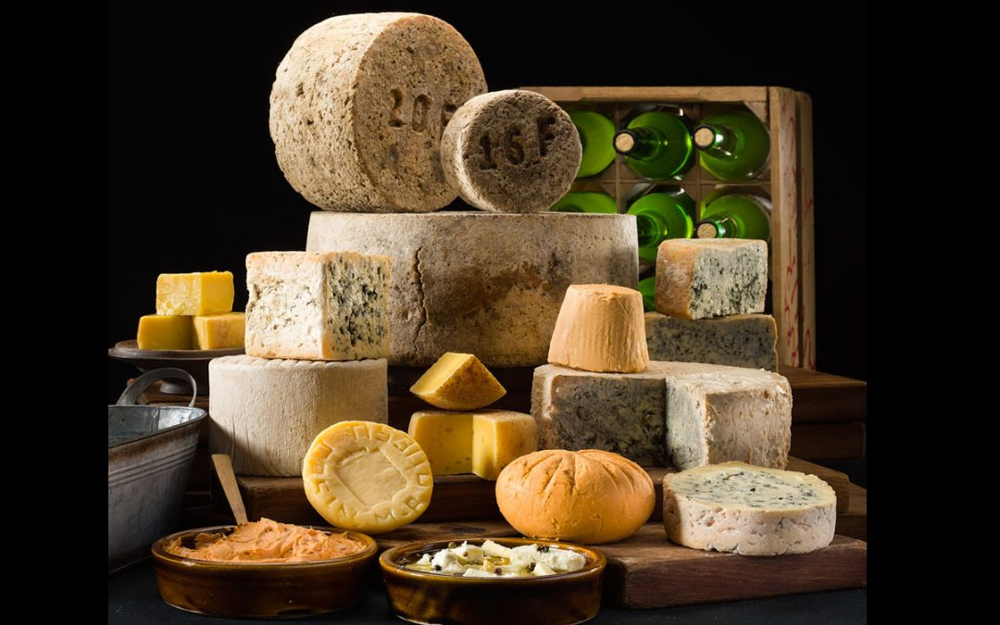

:::{style="font-size: 0.75em; opacity: 0.7;"}
Quesos asturianos tradicionales. Foto: [Archivo Tierra Astur](https://tierra-astur.com)
:::

# Resumen

Este trabajo revisa la [publicacion que hice en LinkedIn](https://www.linkedin.com/pulse/asturias-la-mayor-mancha-quesera-de-europa-juan-riera-udwwf/) el 18 de abril de 2025, actualizando algunos datos de producción con la información disponible en Eurostat para 2024. Los datos referentes a algunos países, así como al número de empresas *queseras* sigue siendo difícil de encontrar. Los nuevos datos no introducen diferencias significativas en las conclusiones.

Examino la producción de queso en Asturias, incluyendo los quesos amparados por Denominación de Origen Protegida (DOP) e Indicación Geográfica Protegida (IGP), y la contrasto con datos de España y Europa. La información, obtenida de diversas fuentes online, que se incluyen en las referencias, se centra en el análisis del queso producido y el número de empresas. No se incluyen en el estudio otras variables económicas como inversión, empleo o contribución al PIB debido a la falta de datos detallados del sector. La información referente al número de empresas queseras es bastante precisa en Asturias, pero muy desigual o inexistente en el resto de las áreas estudiadas. La información sobre la producción de queso está en el mismo caso, dificultando la obtención de conclusiones precisas. Además, no ha sido posible cuantificar con detalle el volumen de producción fuera de la certificación DOP/IGP.

El análisis revela que la producción de queso de Asturias no se sitúa como la más elevada a nivel nacional o europeo, ni en el total ni en la de quesos catalogados. Algunos quesos frescos fabricados por grandes empresas han tenido y siguen teniendo un papel clave en la producción regional; actualmente representan más del 40% de la producción total de queso en la región. 

Asturias destaca por una relativa alta densidad de empresas queseras, calculada en este estudio como el número de empresas por 1000 $km^2$ (especialmente en el ámbito de los quesos con certificación DOP/IGP, sólo por detrás de Suiza). Dado que muchas de estas empresas hacen quesos diferentes, se habla en ocasiones de que Asturias *es la mayor mancha quesera de Europa*, para indicar esta gran variedad de productos.    

Aunque esta diversidad de quesos es notable, el volumen medio de producción por establecimiento es reducido; el valor añadido real derivado de esta variedad de productos y formatos resulta complejo de determinar. La prevalencia de pequeñas producciones, particularmente artesanales, podría suponer un factor limitante para el crecimiento y la sostenibilidad del sector, tanto por la falta de masa crítica para generar los márgenes de explotación suficientes, como por la importancia creciente de los aspectos ambientales y la dificultad para eliminar los residuos generados en una estructura de producción muy repartida y difusa. 

Parece necesaria la elaboración de un plan estratégico sectorial que identifique y potencie los atributos distintivos del queso asturiano y refuerce los quesos catalogados (DOP e IGP) y los quesos de autor, entendiendo como tales aquellos que responden a  criterios de alta calidad. Dicho plan debería establecer también criterios de diferenciación precisos entre los quesos de tradición asturiana y los elaborados en la región sin vinculación con su herencia cultural y gastronómica, y entre las figuras de calidad regulada y la producción artesanal. A ello habría que añadir medidas para la resolución de los problemas ambientales del sector y mecanismos que favorezcan la concentración empresarial en unidades de mayor tamaño.

```{r setup, echo=FALSE, warning=FALSE, message=FALSE}
library (dplyr)
library (ggplot2)
library(tidyr)
library(ggrepel)
library(readxl)
library(kableExtra)
library(gt)
library(mapSpain)
library(sf)
library(rnaturalearth)
library(rnaturalearthdata)
library(scales)

df_tabla_quesos <- read_excel("AOC-Mancha_quesera_europa_update-claude-202604.xlsx", "Producción DOP" )
df_paises <- read_excel("AOC-Mancha_quesera_europa_update-claude-202604.xlsx","Prod por pais")
df_DOP_esp <- read_excel("AOC-Mancha_quesera_europa_update-claude-202604.xlsx","DOP España")
df_consumo <- read_excel("AOC-Mancha_quesera_europa_update-claude-202604.xlsx","España-consumo")
df_asturias <- read_excel("AOC-Mancha_quesera_europa_update-claude-202604.xlsx","SADEI-Asturias-2025")

colnames(df_tabla_quesos) <- c("queso", "tipo", "toneladas", "año", "pais","leche")

df_paises <- df_paises |>
  filter (!is.na(prod_ton_DOP_IGP)) |>
  mutate(
    num_empresas_millon_hab     = num_empresas_queseras / (habitantes/1e6),
    num_empresas_DOP_millon_hab = num_empresas_queseras_DOP / (habitantes/1e6),
    empresas_1000km2            = num_empresas_queseras / (superficie_km2/1000),
    empresas_DOP_1000km2        = num_empresas_queseras_DOP / (superficie_km2/1000),
    kg_queso_habitante          = prod_total_queso_ton * 1000 / habitantes,
    kg_DOP_habitante            = prod_ton_DOP_IGP * 1000 / habitantes,
    ton_tot_km2                 = prod_total_queso_ton / superficie_km2,
    ton_DOP_km2                 = prod_ton_DOP_IGP / superficie_km2,
    ton_queso_por_empresa       = prod_total_queso_ton / num_empresas_queseras,
    ton_queso_DOP_por_empresa   = prod_ton_DOP_IGP / num_empresas_queseras_DOP
  ) 

asturias_data <- df_paises %>% filter(pais == "Asturias")
asturias_ton_tot_km2 <- asturias_data %>% pull(ton_tot_km2)
asturias_ton_dop_km2 <- asturias_data %>% pull(ton_DOP_km2)

# CCAA desde mapSpain
ccaa <- esp_get_ccaa() |> st_transform(4326)

```

# Análisis

## La producción de queso en Asturias

El *Catálogo general de quesos elaborados en Asturias*, en su última edición[@vadequesum2026], referencia con todo detalle las empresas y quesos fabricados en Asturias; recoge un total de **298 referencias producidas en 82 establecimientos**. En su edición anterior, de 2023, citaba 56 que corresponden a productores de denominación catalogada (DOP+IGP). Como la edición de 2025 no detalla esta cifra, mantendré la de 2023 en el análisis, ya que no ha habido en este tiempo cambios sustanciales. 

Estas 298 referencias incluyen todo tipo de quesos, desde artesanos a industriales, fundidos, quesos crema y otros, con el detalle de formatos y marcas, y es la visión más actual de la realidad quesera asturiana. El catálogo ha tenido también el acierto de incluir quesos desaparecidos o en vías de desaparición, que también forman parte de esta cultura quesera asturiana. No obstante, no proporciona el volumen de producción total ni de las diferentes variedades, si exceptuamos los quesos con denominación catalogada (DOP+IGP)

En cuanto al número de empresas queseras, el Ministerio de Agricultura, Pesca y Alimentación (MAPA), en su Anuario de Estadísticas del año 2023[@mapa-1-2023], constata la existencia en España de 1.620 empresas lácteas y 1.990 centros de producción. No especifica el número de empresas queseras ni el volumen total de queso producido. Según datos de la Agencia de Ciencia, Competitividad Empresarial e Innovación Asturiana (SEKUENS)[@sek2026], España contaba en 2024 con 1.577 empresas del sector lácteo *activas*; de ellas, el 5,39% están implantadas en Asturias. Esto equivale a 85 empresas; muy cerca del valor de 82 establecimientos proporcionados por el *Catálogo* mencionado antes; 

La @tbl-tabla-asturias presenta los datos de la producción total de queso en Asturias actualizada a 2025, según la Sociedad Asturiana de Estudios Económicos e Industriales (SADEI)[@sadei].

Desde 2010, la producción de queso en Asturias se mantuvo en torno a 35.000-40.000 toneladas hasta 2022. Entre 2021 y 2023 se registra una caída notable debido principalmente al cierre de la fábrica de Danone en Salas en 2022[@lva2022-2], que traslada la elaboración del queso fresco *Danonino* a otros centros en Francia. A partir de 2023, la producción regional se estabiliza en unas 25.000 toneladas, lo que representa un 4,6% del total nacional,  y en 2025 remonta a 35.310 toneladas, cifra que recoge probablemente el relanzamiento de la actividad en la nueva fábrica de Royal A-Ware en Salas (antigua Danone), especializada en la producción de mozzarella.. Este volumen incluye el queso fresco *Burgo de Arias* y otros quesos frescos fabricados por Mantequerías Arias en su planta de Vegalencia (Soto de Ribera), que elabora anualmente unas 9.000 toneladas de queso (un 36% del total de la región). Si descontamos esta cantidad del total dado por SADEI, podemos situar el volumen de los quesos tradicionales asturianos en torno a las 15.000 toneladas, incluyendo los quesos DOP e IGP.

El detalle de la producción quesera asturiana fuera de las denominaciones de origen no se recoge en ningún informe oficial. Es el caso de quesos importantes y conocidos, algunos tradicionales como Vidiago, Pría, La Peral, Peñamellera, Abredo y otros, y también de los quesos que podrían ser incluidos en los llamados quesos *de autor*, como Rey Silo, Lazana, Varé o La Chivita, y multitud de quesos artesanos producidos en pequeñas queserías, cuyo volumen resulta imposible de estimar.

La @fig-prod-asturias muestra la producción de queso desde 1990. A mitad de los años 2000 se identifica una caída importante de los volúmenes de producción, probablemente reflejo de varios factores, como la crisis de 2008, unida al efecto de la reordenación de la PAC entre 2003 y 2009 y a la relocalización por Mantequerías Arias de una parte importante de la fabricación de Burgo de Arias en la nueva factoría de Burgos, hacia 2006. También se ve claramente el cese de actividad de Danone en Salas en 2023, y el relanzamiento de la actividad por Royal A-Ware en 2025, como comentábamos anteriormente.

```{r}
#| label: fig-prod-asturias
#| fig-cap: "Producción de queso en Asturias 1990-2025 (SADEI, 2025)"
#| echo: FALSE
#| warning: FALSE
#| message: FALSE
#| fig-height: 4

df_asturias |>
  ggplot(aes(x=año, y = ton))+
    geom_line(color="#D55E00", linewidth=1.5) +
    labs(
    x = "Año",
    y = "Toneladas"
    ) +
    theme_minimal()

```


```{r echo=FALSE, warning=FALSE, message=FALSE, results='asis'}
#| label: tbl-tabla-asturias
#| tbl-cap: "Producción de queso en Asturias desde 2015 (SADEI, 2025)"
#| 
df_asturias %>%
  filter (año >= 2015) %>%
   # 1. Creamos el objeto gt
  gt() %>%
  
  # 2. Etiquetas de columna profesionales
  cols_label(
    año = "Año",
    ton = "Queso producido (toneladas)"
  ) %>%
  
  # 3. Formateo numérico "estilo europeo" directamente en gt
  fmt_number(
    columns = ton,
    decimals = 0,
    sep_mark = ".",
    dec_mark = ","
  ) %>%
  
  # 4. Alineación
  cols_align(
    align = "center", columns = año
  ) %>%
  cols_align(
    align = "right", columns = ton
  ) %>%
  
  # 5. Opciones de estilo adicionales para que quede impecable
  tab_options(
    table.width = pct(40),
    column_labels.font.weight = "bold"
  )

```

## La producción y consumo de queso en España

Según la Encuesta Anual de Industrias Lácteas del MAPA[@mapa-5-2024], la producción nacional de queso en 2024 fue de 538.300 toneladas.

Los valores de producción de los quesos con DOP o IGP se conocen con detalle, porque estos datos están recogidos por los propios Consejos Reguladores, y también por la Subdirección General de Control de la Calidad Alimentaria y Laboratorios Agroalimentarios del MAPA[@mapa-3-2023].

La @fig-DOP muestra los quesos catalogados españoles con mayor producción en 2023 (más de 300 toneladas/año) según los datos ofrecidos por el MAPA en el informe *Datos de las Denominaciones de Origen Protegidas (D.O.P.), Indicaciones Geográficas Protegidas (I.G.P.) y Especialidades Tradicionales Garantizadas (E.T.G.) de Productos Agroalimentarios*[@mapa-2-2023]. De los quesos con DOP+IGP asturianos, sólo el Cabrales aparece en la tabla, con 361 toneladas en 2023. El detalle de los quesos DOP e IGP españoles puede consultarse en la @tbl-tabla-dop, que figura en anexo.

```{r echo=FALSE, warning=FALSE, message=FALSE, fig.pos='H', fig.height=3}
#| label: fig-DOP
#| fig-cap: "Quesos DOP españoles con una producción anual superior a 300 toneladas"

df_DOP_esp %>%
  filter(Ton > 300) %>%
  mutate(highlight = if_else(Region %in% c("Asturias"), Region, "Otros")) %>%
  ggplot(aes(y = reorder(Queso, Ton), x = Ton, fill = highlight)) +
    geom_col() +
    geom_text(aes(label = if_else(Region == "Asturias", as.character(as.integer(Ton)), NA_character_)), 
          hjust = 0, size = 3, colour = "grey", na.rm = TRUE) +
    scale_fill_manual(values = c("Otros" = "grey60",    # Todas las barras en gris
                               "Asturias" = "#D55E00")) +  # Rojo destacado
   expand_limits(x = 20000) +
   labs(x = "toneladas")+
  scale_x_continuous(labels = scales::comma) +
  theme_minimal() +
  theme(
    panel.grid.minor = element_blank(),
    axis.text.x = element_text(angle = 0, hjust = 0.5),# Rotar etiquetas del eje x para mejor legibilidad
    axis.text = element_text(size = 8), # Cambia el tamaño de las etiquetas del eje
    axis.title = element_text(size = 10), # Cambia el tamaño de los títulos de los ejes
    plot.title = element_text(size = 12, hjust = 0.5), # Cambia el tamaño del título principal
    legend.position = "none",
    axis.title.y = element_blank())
```

La @fig-DOP-es muestra la producción y el número de queserías por comunidades autónomas. Asturias es la región con más quesos catalogados (5) y una de las regiones con mayor número de queserías, aunque el volumen total producido es bajo.

:::{#fig-DOP-es layout-ncol=1 layout-nrow=3}

```{r echo=FALSE, warning=FALSE, message=FALSE}
#| label: fig-DOP-es-ton
#| fig-cap: "Toneladas producidas"

df_ton_region <- df_DOP_esp |>
  group_by(Region) |>
  summarise(tot_ton = sum(Ton, na.rm = TRUE)) |>
  mutate(tot_ton = round(tot_ton/10)*10)

ccaa_ton <- esp_get_ccaa(moveCAN = TRUE) |>
  st_transform(4326) |>
  mutate(Region = case_when(
    ccaa.shortname.es == "Castilla-La Mancha" ~ "Castilla-La-Mancha",
    ccaa.shortname.es == "Castilla y León"    ~ "Castilla-León",
    ccaa.shortname.es == "La Rioja"           ~ "La-Rioja",
    ccaa.shortname.es == "País Vasco"         ~ "País.Vasco",
    TRUE ~ ccaa.shortname.es
  )) |>
  left_join(df_ton_region, by = "Region")

centroides_ton <- ccaa_ton |> st_centroid()

ggplot(ccaa_ton) +
  geom_sf(aes(fill = tot_ton), color = "white", linewidth = 0.3) +
  geom_sf_text(data = centroides_ton,
               aes(label = scales::comma(tot_ton, big.mark = ".", decimal.mark = ",",accuracy = 1)),
               size = 2.5, color = "black", na.rm = TRUE) +
  scale_fill_distiller(
    palette   = "YlOrRd",
    direction = 1,
    name      = "toneladas",
    na.value  = "grey85",
    labels    = scales::comma
  ) +
  theme_void() +
  theme(
    axis.text       = element_blank(),
    axis.ticks      = element_blank(),
    panel.grid      = element_blank(),
    legend.position = "right"
  ) +
  labs(caption = "Fuente: MAPA 2023")

```

```{r echo=FALSE, warning=FALSE, message=FALSE}
#| label: fig-DOP-es-queserias
#| fig-cap: "Número de queserías con producción DOP/IGP"

# Agrega queserías por región
df_queserias_region <- df_DOP_esp |>
  group_by(Region) |>
  summarise(tot_queserias = sum(queserias, na.rm = TRUE))

rm(ccaa_join)

ccaa_join <- esp_get_ccaa() |>
  st_transform(4326) |>
  mutate(Region = case_when(
    ccaa.shortname.es == "Castilla-La Mancha" ~ "Castilla-La-Mancha",
    ccaa.shortname.es == "Castilla y León"    ~ "Castilla-León",
    ccaa.shortname.es == "La Rioja"           ~ "La-Rioja",
    ccaa.shortname.es == "País Vasco"         ~ "País.Vasco",
    TRUE ~ ccaa.shortname.es
  )) |>
  left_join(df_queserias_region, by = "Region")

ggplot(ccaa_join) +
  geom_sf(aes(fill = tot_queserias), color = "white", linewidth = 0.3) +
  geom_sf_text(aes(label = tot_queserias), 
               size = 3, 
               color = "black",
               na.rm = TRUE) +
  scale_fill_distiller(
    palette   = "YlOrRd",
    direction = 1,
    name      = "Queserías",
    na.value  = "grey85",
    labels    = scales::comma
  ) +
  theme_void() +
  theme(
    axis.text       = element_blank(),
    axis.ticks      = element_blank(),
    panel.grid      = element_blank(),
    legend.position = "right"
  ) +
  labs(caption = "Fuente: MAPA")

```

```{r}
#| label: fig-esp-queserias
#| fig-cap: "Producción de quesos catalogados con DOP e IGP en España. El número de denominaciones catalogadas en cada región se indica en el interior de cada punto."
#| echo: FALSE
#| warning: FALSE
#| message: FALSE

df_DOP_esp %>%
  group_by(Region) %>%
  summarise(
    TotalTon = sum(Ton, na.rm = TRUE),
    tot_queserias = sum(queserias, na.rm = TRUE),
    n_dop_igp = n()   # <-- recuento de DOP/IGP por región
  ) %>%
  mutate(
    highlight = case_when(
      Region == "Asturias" ~ "Asturias",
      TRUE ~ "Otros"
    )
  ) %>%
  ggplot(aes(x = TotalTon, y = tot_queserias)) +
  
  # Puntos con tamaño proporcional
  geom_point(aes(color = highlight, size = n_dop_igp), alpha = 0.8) +
  
  # Número dentro del punto
  geom_text(aes(label = n_dop_igp),
            color = "white",
            size = 3,
            fontface = "bold") +
  
  # Etiquetas externas con repel
  geom_text_repel(
    aes(label = Region, color = highlight),
    size = 3,
    fontface = "plain",
    max.overlaps = Inf,
    box.padding = 0.8,
    point.padding = 1.2,
    min.segment.length = 0,
    segment.color = 'grey80'
  ) +
  
  scale_color_manual(values = c(
    "Otros" = "grey60",
    "España" = "#1f77b4",
    "Asturias" = "#D55E00"
  )) +
  
  scale_size_continuous(range = c(3, 12)) +
  
  scale_x_continuous(labels = scales::comma) +
  scale_y_continuous(labels = scales::comma) +
  labs(
    x = "Toneladas producidas DOP+IGP",
    y = "Núm de queserías",
    size = "Nº DOP/IGP"
  ) +
  theme_minimal() +
  theme(
    legend.position = "none",
    panel.grid.major = element_blank(),
    panel.grid.minor = element_blank(),
    axis.line = element_line(color = "grey80")
  )

```

Producción de quesos catalogados (DOP e IGP) en España, por Comunidades Autónomas

:::

Respecto al consumo de queso por CCAA, el último Informe anual del consumo alimentario del MAPA para 2023[@mapa-3-2023], estima el consumo total de queso en España en unas 350 mil toneladas, con un consumo per cápita de 7,56 kg. ([@tbl-tabla-consumo]).  Asturias, con un consumo per cápita de 8,1 kg, se sitúa en la zona media‐alta de la tabla.

```{r echo=FALSE, warning=FALSE, message=FALSE}
#| label: tbl-tabla-consumo
#| tbl-cap: "Datos de consumo per cápita en España por Comunidad Autónoma"

df_consumo %>%
  arrange(-consumo_por_hab) %>%
  mutate(
    poblacion_pct = scales::percent(poblacion_pct/100, accuracy = 0.1),
    kg_pct = scales::percent(kg_pct/100, accuracy = 0.1),
    consumo_por_hab = scales::number(consumo_por_hab, big.mark = ".", decimal.mark = ",", accuracy = 0.1)
  ) %>%
  knitr::kable(format="markdown",
               col.names = c("Comunidad Autónoma", "% poblacion", "% kilos", "Consumo per cápita"),
               align = c("l", "r", "r", "r"))
```

Para analizar el consumo de queso por Comunidad Autónoma, comparo la participación en el consumo con su cuota poblacional, calculada ésta como el porcentaje de población de cada Comunidad Autónoma sobre la población total. La [@fig-consumo] muestra la diferencia entre el porcentaje de consumo y la cuota poblacional, junto con el consumo per cápita; destaca el alto consumo de queso en Canarias, y el bajo consumo de Andalucía y Castilla-La Mancha. Las CCAA que están en color cercano al blanco (Asturias y Baleares) tienen un consumo de queso que se corresponde con su cuota poblacional. Podemos decir que las regiones en las que el consumo de queso es superior a su cuota poblacional son comunidades con un consumo de queso bien establecido y maduro. Las comunidades en las que esta diferencia es negativa, es decir, en las que el consumo es inferior a su cuota poblacional, podrían suponer una oportunidad para el desarollo del consumo del queso, y quizás de los quesos catalogados. Sería también interesante verificar el impacto del turismo europeo sobre el elevado consumo de queso en algunas regiones como Valencia, Baleares y Canarias.

```{r echo=FALSE, warning=FALSE, message=FALSE}
#| label: fig-consumo
#| fig-cap: "Consumo de queso por CCAA."
#| out-width: "125%"


df_consumo_mapa <- df_consumo |>
  mutate(
    diferencia      = kg_pct - poblacion_pct,
    consumo_por_hab = as.numeric(gsub(",", ".", as.character(consumo_por_hab))),
    Region = case_when(
      Comunidad == "Cataluña"                ~ "Cataluña",
      Comunidad == "Aragón"                  ~ "Aragón",
      Comunidad == "Illes Balears"           ~ "Baleares",
      Comunidad == "Comunitat Valenciana"    ~ "Comunidad Valenciana",
      Comunidad == "Región de Murcia"        ~ "Murcia",
      Comunidad == "Andalucía"               ~ "Andalucía",
      Comunidad == "Comunidad de Madrid"     ~ "Madrid",
      Comunidad == "Castilla-La Mancha"      ~ "Castilla-La Mancha",
      Comunidad == "Extremadura"             ~ "Extremadura",
      Comunidad == "Castilla Y Leon"         ~ "Castilla y León",
      Comunidad == "Galicia"                 ~ "Galicia",
      Comunidad == "Principado de Asturias"  ~ "Asturias",
      Comunidad == "Cantabria"               ~ "Cantabria",
      Comunidad == "Pais Vasco"              ~ "País Vasco",
      Comunidad == "La Rioja"                ~ "La Rioja",
      Comunidad == "C. Foral de Navarra"     ~ "Navarra",
      Comunidad == "Canarias"                ~ "Canarias",
      TRUE ~ Comunidad
    )
  )

lim_dif <- max(abs(df_consumo_mapa$diferencia), na.rm = TRUE)

# Shapefile base
ccaa_base <- esp_get_ccaa(moveCAN = TRUE) |>
  st_transform(4326) |>
  left_join(df_consumo_mapa, by = c("ccaa.shortname.es" = "Region"))

centroides <- ccaa_base |> st_centroid()


p2 <- ggplot(ccaa_base) +
  geom_sf(aes(fill = diferencia), color = "grey50", linewidth = 0.3) +
  geom_sf(data = centroides,
          aes(size = consumo_por_hab),
          shape = 21, fill = "white", color = "grey30",
          alpha = 0.7, na.rm = TRUE) +
  geom_sf_text(data = centroides,
               aes(label = ifelse(!is.na(consumo_por_hab),
                                  gsub("\\.", ",", sprintf("%.1f", consumo_por_hab)),
                                  NA)),
               size = 2.2, color = "black", na.rm = TRUE) +
  scale_fill_distiller(
    palette   = "RdBu",
    direction = -1,
    name      = "Diferencia\n(%)",
    na.value  = "grey85",
    limits    = c(-lim_dif, lim_dif)
  ) +
  scale_size_continuous(name = "kg/hab", range = c(2, 16), limits = c(6, NA), guide = "none") +
  theme_void() +
  theme(axis.text = element_blank(), axis.ticks = element_blank(),
        panel.grid = element_blank(), legend.position = "right") +
  labs( caption  = "Color: diferencia entre % de consumo y % de cuota poblacional·\nTamaño burbuja: consumo per cápita.\nFuente: MAPA 2023")

print(p2)

```

## La producción de queso en Europa

Los datos de la producción de queso en España y Europa (totales y catalogados), recogidos de diversas fuentes que se relacionan al final del artículo, se han agrupado en dos tablas:

La @tbl-tabla-paises presenta la producción quesera en varios países europeos, incluyendo los volúmenes totales y los catalogados con DOP o IGP. En esta tabla recojo también la población y la superficie de estos países. He eliminado los países europeos para los que no dispongo de datos de producción DOP.

```{r echo=FALSE, warning=FALSE, message=FALSE}
#| label: tbl-tabla-paises
#| tbl-cap: "Estadísticas de población, superficie y producción de queso de algunos países."

df_paises %>%
  # 1. ORDENAR: Fundamental hacerlo cuando aún son números
  arrange(
    if_else(pais == "Asturias", 2, 1), 
    desc(prod_total_queso_ton)
  ) %>%
  
  # 2. SELECCIONAR: Tus 8 columnas
  select(1:8) %>%
  
  # 3. TRANSFORMAR Y LIMPIAR: 
  # Aquí 'format' convierte el número en texto. 
  # El 'if_else' detecta el NA numérico y lo cambia por un "" de texto.
  mutate(across(where(is.numeric), 
                ~ if_else(is.na(.), "", format(., big.mark = ".", decimal.mark = ",")))) %>%
  
  # 4. LIMPIAR CARACTERES: Por si acaso la columna 'pais' tiene algún NA
  mutate(across(where(is.character), ~ replace_na(., ""))) %>%
  
  # 5. TABLA
  knitr::kable(
    format = "markdown",
    col.names = c("País", "Población", "Km²", "Prod. queso (Ton)", "Prod. queso DOP+IGP (Ton)", 
                  "Quesos DOP+IGP", "Empresas queseras", "Empresas DOP"),
    align = c("l", "r", "r", "r", "r", "r", "r", "r")
  )
```

::: {.smalltext style="font-size: 0.8em;"}
Fuentes: Eurostat(2025) @eurostat_apro_mk_pobta_2025; INAO(2024) @inao_cnaol_2024; Qualivita(2023) @ismea_qualivita_2023; Swiss PDO-PGI Association(2023) @aop_igp_ch_2023; Switzerland Cheese Marketing/TSM (2024) @switzerland_cheese_marketing_2025 ; MAPA(2023) @mapa_dopigp_2023  y otros.
:::

Asturias se ha incluido en la tabla para reflejar su posición en comparación con otros países según los índices considerados.

Algunos países, como Francia o Suiza, publican datos detallados; en otros casos he tenido que estimar el número total de empresas queseras y el número de empresas o centros de producción. Tampoco es fácil encontrar el número de empresas queseras por región, ya sean de queso en general o de DOP+IGP, y por eso he hecho el análisis para los datos de países completos. En muchos casos, una misma empresa puede operar en varios centros de producción, y elaborar tanto quesos catalogados como no catalogados. Por todo ello, es posible que los datos no sean completamente exactos y necesiten una revisión adicional. Cualquier información al respecto será de gran ayuda para mejorar el contenido del trabajo en revisiones posteriores.

Los quesos DOP+IGP están bien identificados por país. Se han recogido un total de 221 variedades europeas, que se pueden consultar en la @tbl-tabla-dop incluida como anexo. No he podido confirmar los volúmenes de algunas de estas variedades, y por lo tanto han quedado excluidas del análisis. 

La @fig-produccion-2 muestra el mapa de las producciones totales de queso y queso DOP+IGP por país. 

```{r}
#| echo: FALSE
#| warning: FALSE
#| message: FALSE
#| label: fig-produccion-2
#| fig-cap: "Producción total de queso y queso catalogado en Europa"


df_paises <- df_paises %>%
  filter(pais != "Asturias")


df_asturias <- tibble(
  pais = "Asturias",
  prod_total_queso_ton = 25168,
  prod_ton_DOP_IGP = 660
)

# --- 2. Mapa base Europa ---
eu <- ne_countries(scale = "medium", returnclass = "sf") %>%
  filter(region_un == "Europe") %>%
  rename(pais = name) %>%
  mutate(pais = case_when(
    pais == "Germany"        ~ "Alemania",
    pais == "France"         ~ "Francia",
    pais == "Italy"          ~ "Italia",
    pais == "Netherlands"    ~ "Paises Bajos",
    pais == "Poland"         ~ "Polonia",
    pais == "Spain"          ~ "España",
    pais == "Denmark"        ~ "Dinamarca",
    pais == "Ireland"        ~ "Irlanda",
    pais == "Greece"         ~ "Grecia",
    pais == "Switzerland"    ~ "Suiza",
    pais == "Austria"        ~ "Austria",
    pais == "Belgium"        ~ "Bélgica",
    pais == "Norway"         ~ "Noruega",
    pais == "Portugal"       ~ "Portugal",
    pais == "Cyprus"         ~ "Chipre",
    pais == "Croatia"        ~ "Croacia",
    TRUE ~ pais
  ))

# --- 3. Join ---
eu_data <- eu %>%
  left_join(df_paises, by = "pais")

eu_metro <- eu_data %>%
  st_crop(xmin = -25, ymin = 34, xmax = 45, ymax = 72) # recorta ultramar antes del centroide

centroides_eu <- st_centroid(eu_metro)


# --- 4. Rangos globales (incluye Asturias) ---
rango_total <- range(c(eu_data$prod_total_queso_ton, df_asturias$prod_total_queso_ton), na.rm = TRUE)
rango_dop   <- range(c(eu_data$prod_ton_DOP_IGP,     df_asturias$prod_ton_DOP_IGP),     na.rm = TRUE)

# --- 5. Punto Asturias ---
asturias_pt <- st_sf(
  df_asturias,
  geometry = st_sfc(st_point(c(-5.86, 43.36)), crs = 4326)
)

# coordenadas LAEA de Asturias (aproximadas)
asturias_laea <- st_transform(asturias_pt, 
                              crs = "+proj=laea +lat_0=52 +lon_0=10 +x_0=4321000 +y_0=3210000 +ellps=GRS80")
asturias_coords <- st_coordinates(asturias_laea)
esp_ccaa <- ne_states(country = "Spain", returnclass = "sf")
asturias_pol <- esp_ccaa %>% filter(name == "Asturias")

# --- 6. Mapa principal ---
p_europa <- ggplot(eu_data) +
  geom_sf(aes(fill = prod_total_queso_ton), color = "white", linewidth = 0.2) +
  geom_sf(fill = NA, color = "grey30", linewidth = 0.4) +
  
  # --- capa Asturias ---
  geom_sf(data = asturias_pol,
          fill = scales::colour_ramp(
            RColorBrewer::brewer.pal(9, "YlGnBu"))(
              (25168 - rango_total[1]) / diff(rango_total)),
          color = "grey30", linewidth = 0.3) +
  
  geom_sf(data = centroides_eu,
          aes(size = prod_ton_DOP_IGP),
          shape = 21, fill = "white", color = "grey30",
          alpha = 0.8, na.rm = TRUE) +
  geom_sf_text(data = centroides_eu,
               aes(label = ifelse(!is.na(prod_ton_DOP_IGP),
                                  scales::comma(prod_ton_DOP_IGP), "")),
               size = 2.5, color = "black") +
  scale_fill_distiller(
    palette = "YlGnBu",
    direction = 1,
    limits = rango_total,
    name = "Producción total\n(toneladas)",
    na.value = "grey90",
    labels = scales::comma
  ) +
  scale_size_continuous(
    limits = rango_dop,
    range = c(2, 18),
    guide = "none"
  ) +
  
  # añadir al p_europa, después de las demás capas y antes de coord_sf:
  annotate("segment",
           x = asturias_coords[1] - 300000, y = asturias_coords[2] + 300000,
           xend = asturias_coords[1], yend = asturias_coords[2],
           color = "grey30", linewidth = 0.4, arrow = arrow(length = unit(0.15, "cm"))) +
  annotate("label",
           x = asturias_coords[1] - 400000, y = asturias_coords[2] + 300000,
           label = paste0("Asturias\nDOP/IGP: ", scales::comma(660), " t"),
           size = 2.5, color = "grey20", fill = "white",
           label.size = 0.3, hjust = 0) +
  
  coord_sf(crs = "+proj=laea +lat_0=52 +lon_0=10 +x_0=4321000 +y_0=3210000 +ellps=GRS80",
           xlim = c(2500000, 6600000), ylim = c(1500000, 5500000)) +
  theme_void() +
  theme(
    legend.position = "right",
    panel.grid = element_blank()
  ) +
  labs(caption = "Burbuja: Producción de queso DOP/IGP en toneladas\nFuente: elaboración propia" )

p_europa

```


El mayor productor de queso europeo es Alemania; la producción de España es semejante a la de Dinamarca. El mayor productor de queso con DOP o IGP es Italia, gracias al enorme volumen de sus quesos Parmiggiano-Reggiano y Grana Padano. Este país también tiene una gran riqueza de quesos regionales con DOP+IGP (52), a la altura de Francia (57); casi el 50% de su producción quesera está catalogada.

La producción de queso catalogado en Europa es muy superior a la de España y Asturias, tanto en total como en cada variedad. La @fig-tabla-pct-DOP nos muestra que varios países tienen un porcentaje significativo de su producción quesera catalogada. Si la estrategia para Asturias es fomentar el desarrollo de productos con valor añadido con apoyo institucional, sin duda es de interés conocer en detalle las experiencias y la estructura del sector en estos países, y la forma en la que se articula el apoyo institucional a los quesos catalogados.

```{r}
#| echo: FALSE
#| warning: FALSE
#| message: FALSE
#| label: fig-tabla-pct-DOP
#| fig-cap: "Peso de la producción DOP/IGP sobre la producción total"
#| 
df_pct_dop <- df_paises |>
  mutate(
    pct_dop = (prod_ton_DOP_IGP / prod_total_queso_ton * 100) 
  )
eu_pct <- eu %>%
  left_join(df_pct_dop, by = "pais")

p_pct_dop <- ggplot(eu_pct) +
  geom_sf(aes(fill = pct_dop), color = "white", linewidth = 0.2) +
  geom_sf(fill = NA, color = "grey30", linewidth = 0.4) +
    # --- capa Asturias ---
  geom_sf(data = asturias_pol,
          fill = scales::colour_ramp(
            RColorBrewer::brewer.pal(9, "YlOrRd"))(
              (660 / 25168 * 100) / max(df_pct_dop$pct_dop, na.rm = TRUE)),
          color = "grey30", linewidth = 0.3) +
  annotate("segment",
           x = asturias_coords[1] - 300000, y = asturias_coords[2] + 300000,
           xend = asturias_coords[1], yend = asturias_coords[2],
           color = "grey30", linewidth = 0.4, arrow = arrow(length = unit(0.15, "cm"))) +
  annotate("label",
           x = asturias_coords[1] - 300000, y = asturias_coords[2] + 300000,
           label = paste0("Asturias\nDOP/IGP: ", round(660 / 25168 * 100, 1), "%"),
           size = 2.5, color = "grey20", fill = "white",
           label.size = 0.3, hjust = 0) +
  scale_fill_distiller(
    palette = "YlOrRd",
    direction = 1,
    name = "% producción DOP/IGP\nsobre total",
    na.value = "grey90",
    labels = function(x) paste0(x, "%")
  ) +
  coord_sf(crs = "+proj=laea +lat_0=52 +lon_0=10 +x_0=4321000 +y_0=3210000 +ellps=GRS80",
           xlim = c(2500000, 6600000), ylim = c(1500000, 5500000)) +
  theme_void() +
  theme(legend.position = "right", panel.grid = element_blank()) +
  labs(caption = "Fuente: elaboración propia")

p_pct_dop
```

La @fig-DOP-queso presenta los quesos europeos con DOP+IGP que hacen más de 10.000 toneladas (recordemos que los quesos asturianos DOP+IGP no alcanzan las 1000 toneladas). La lista está encabezada por un queso holandés, dos italianos, un griego y un francés. 

Entre los quesos españoles, sólo aparece en este gráfico el manchego, con 17.000 toneladas anuales, en una posición intermedia. De los quesos asturianos, el primero en la tabla general sería el Cabrales en la posición 103; no llega a mostrarse en el gráfico.

```{r echo=FALSE, warning=FALSE, message=FALSE}
#| label: fig-DOP-queso
#| fig-cap: "Quesos DOP europeos con una producción anual superior a 10.000 toneladas"


color_paleta <- c(
  "España"   = "#0072B2",  # Azul (Mantenido)
  "Asturias" = "#D55E00",  # Naranja/Rojo (Mantenido)
  
  # Escala de grises diferenciada (de más oscuro a más claro)
  "Francia"       = "#333333",  # Gris casi negro (más profundo)
  "Italia"        = "#666666",  # Gris oscuro
  "Países Bajos"  = "#888888",  # Gris medio-oscuro (NUEVO)
  "Suiza"         = "#AAAAAA",  # Gris medio
  "Grecia"        = "#CCCCCC",  # Gris claro
  "Otros"         = "#EEEEEE"   # Gris muy claro (fondo/secundario)
)

df_tabla_quesos %>%
  filter((toneladas > 10000)) %>%
  mutate(highlight = case_when(
    pais == "España" ~ "España",
    pais == "Asturias" ~ "Asturias",
    pais == "Francia" ~ "Francia",
    pais == "Italia" ~ "Italia",
    pais == "Países Bajos" ~ "Países Bajos",    
    pais == "Suiza" ~ "Suiza",
    pais == "Grecia" ~ "Grecia",
    TRUE ~ "Otros"
  )) %>%
  mutate(highlight = factor(highlight, levels = c("España", "Asturias", "Francia", "Italia", "Países Bajos", "Suiza", "Grecia", "Otros"))) %>%
  ggplot(aes(y = reorder(queso, toneladas), x = toneladas, fill = highlight)) +
  geom_bar(stat = "identity", width = 0.7) +
  geom_text(aes(label = if_else(pais == "España", as.character(as.integer(toneladas)), NA_character_)), 
          hjust = 0, size = 2, colour = "grey", na.rm = TRUE) +
  scale_fill_manual(values = color_paleta) +  # Aplicamos la paleta personalizada
  labs(x = "toneladas",
       fill = "País") +  # Se mantiene la leyenda
  scale_x_continuous(labels = scales::comma) +
  theme_minimal() +
  theme(
    axis.text.x = element_text(angle = 0, hjust = 0.5),
    axis.title.y = element_blank(),
    axis.text = element_text(size = 8),
    axis.title = element_text(size = 10),
    panel.grid.minor = element_blank(),
    plot.title = element_text(size = 12, hjust = 0.5))
```

## Indices comparativos entre Asturias y Europa

Para comparar la producción de queso en Asturias con la producción total de los países de la UE, puede ser útil establecer índices relativos, como la producción por habitante o por $km^2$. 

::: important
Antes de presentar el análisis de estas ratios, es importante señalar que comparar Asturias con países europeos en su totalidad puede dar una visión distorsionada. La producción de queso no es uniforme a lo largo de un país; suele focalizarse en zonas concretas. Si se dispusiera de datos regionales y se comparasen con las áreas queseras asturianas, es probable que las ratios de producción por habitante o por $km^2$ en otras regiones queseras europeas fueran significativamente mayores. He utilizado las cifras nacionales ante la falta de información regional detallada.}
:::

La @fig-pct-habitante presenta los datos de producción de queso en kilogramos por habitante. Los mayores productores de queso de acuerdo a este índice son Dinamarca, Países Bajos e Irlanda; en los quesos DOP+IGP, lo son Países Bajos, Chipre y Grecia, con Italia y Suiza a una distancia moderada. Asturias tiene una producción total por habitante superior a la de Italia, Grecia o Suiza. En cambio, en la producción DOP/IGP, se sitúa casi al final de la lista. 

```{r}
#| echo: FALSE
#| warning: FALSE
#| message: FALSE
#| label: fig-pct-habitante
#| fig-cap: "Producción de queso por habitante, total y catalogado (kg)"

rango_kg_total <- range(c(df_paises$kg_queso_habitante, 660/1000000*1000), na.rm = TRUE)
rango_kg_dop   <- range(c(df_paises$kg_DOP_habitante,   660/1000000*1000), na.rm = TRUE)

eu_kg <- eu %>%
  left_join(df_paises, by = "pais")

centroides_kg <- st_centroid(eu_kg)
st_geometry(centroides_kg)[centroides_kg$pais == "Francia"] <- 
  st_geometry(st_sfc(st_point(c(2.5, 46.5)), crs = 4326))

asturias_kg <- 660 / 1000000 * 1000  # prod_ton_DOP_IGP / habitantes * 1000 = kg/hab
asturias_kg_total <- 25168 / 1000000 * 1000

p_kg_hab <- ggplot(eu_kg) +
  geom_sf(aes(fill = kg_queso_habitante), color = "white", linewidth = 0.2) +
  geom_sf(fill = NA, color = "grey30", linewidth = 0.4) +

  # --- capa Asturias ---
  geom_sf(data = asturias_pol,
          fill = scales::colour_ramp(
            RColorBrewer::brewer.pal(9, "YlGnBu"))(
              (asturias_kg_total - rango_kg_total[1]) / diff(rango_kg_total)),
          color = "grey30", linewidth = 0.3) +

  # burbujas países
  geom_sf(data = centroides_kg,
          aes(size = kg_DOP_habitante),
          shape = 21, fill = "white", color = "grey30",
          alpha = 0.8, na.rm = TRUE) +
  geom_sf_text(data = centroides_kg,
               aes(label = ifelse(!is.na(kg_DOP_habitante),
                                  scales::number(kg_DOP_habitante, accuracy = 0.1), "")),
               size = 2.5, color = "black") +

  # anotación Asturias
  annotate("segment",
           x = asturias_coords[1] - 300000, y = asturias_coords[2] + 400000,
           xend = asturias_coords[1], yend = asturias_coords[2],
           color = "grey30", linewidth = 0.4, arrow = arrow(length = unit(0.15, "cm"))) +
  annotate("label",
           x = asturias_coords[1] - 300000, y = asturias_coords[2] + 400000,
           label = paste0("Asturias\n", round(asturias_kg, 2), " kg/hab DOP"),
           size = 2.5, color = "grey20", fill = "white",
           label.size = 0.3, hjust = 0) +

  scale_fill_distiller(
    palette = "YlGnBu", direction = 1,
    limits = rango_kg_total,
    name = "Producción total\n(kg/habitante)",
    na.value = "grey90",
    labels = scales::label_number(accuracy = 0.1)
  ) +
  scale_size_continuous(
    limits = rango_kg_dop,
    range = c(2, 18),
    guide = "none"
  ) +
  coord_sf(crs = "+proj=laea +lat_0=52 +lon_0=10 +x_0=4321000 +y_0=3210000 +ellps=GRS80",
           xlim = c(2500000, 6600000), ylim = c(1500000, 5500000)) +
  theme_void() +
  theme(legend.position = "right", panel.grid = element_blank()) +
  labs( caption = "Burbuja: Producción de queso DOP/IGP en kg/habitante\nFuente: elaboración propia")

p_kg_hab
```

La @fig-km2 presenta la producción de queso por unidad de superficie de la zona considerada (toneladas/$km^2$). Destaca la enorme producción de Países Bajos, tanto total como de DOP. En cuanto al total de queso producido, Asturias presenta un índice ligeramente superior al de Grecia y al promedio de España; en DOP/IGP está entre las regiones más bajas.

```{r}
#| label: fig-km2
#| echo: FALSE
#| warning: FALSE
#| message: FALSE
#| fig-cap: "Producción de queso por km2"

rango_km2_total <- range(df_paises$ton_tot_km2, na.rm = TRUE)
rango_km2_dop   <- range(df_paises$ton_DOP_km2, na.rm = TRUE)

eu_km2 <- eu %>%
  left_join(df_paises, by = "pais")

centroides_km2 <- st_centroid(eu_km2)
st_geometry(centroides_km2)[centroides_km2$pais == "Francia"] <-
  st_geometry(st_sfc(st_point(c(2.5, 46.5)), crs = 4326))

p_km2 <- ggplot(eu_km2) +
  geom_sf(aes(fill = ton_tot_km2), color = "white", linewidth = 0.2) +
  geom_sf(fill = NA, color = "grey30", linewidth = 0.4) +

  # --- capa Asturias ---
  geom_sf(data = asturias_pol,
          fill = scales::colour_ramp(
            RColorBrewer::brewer.pal(9, "YlGnBu"))(
              (asturias_ton_tot_km2 - rango_km2_total[1]) / diff(rango_km2_total)),
          color = "grey30", linewidth = 0.3) +

  # burbujas países
  geom_sf(data = centroides_km2,
          aes(size = ton_DOP_km2),
          shape = 21, fill = "white", color = "grey30",
          alpha = 0.8, na.rm = TRUE) +
  geom_sf_text(data = centroides_km2,
               aes(label = ifelse(!is.na(ton_DOP_km2),
                                  scales::number(ton_DOP_km2, accuracy = 0.01), "")),
               size = 2.5, color = "black") +

  # anotación Asturias
  annotate("segment",
           x = asturias_coords[1] - 300000, y = asturias_coords[2] + 400000,
           xend = asturias_coords[1], yend = asturias_coords[2],
           color = "grey30", linewidth = 0.4, arrow = arrow(length = unit(0.15, "cm"))) +
  annotate("label",
           x = asturias_coords[1] - 300000, y = asturias_coords[2] + 400000,
           label = paste0("Asturias\n", round(asturias_ton_dop_km2, 2), " t/km² DOP"),
           size = 2.5, color = "grey20", fill = "white",
           label.size = 0.3, hjust = 0) +

  scale_fill_distiller(
    palette = "YlGnBu", direction = 1,
    limits = rango_km2_total,
    name = "Producción total\n(t/km²)",
    na.value = "grey90",
    labels = scales::label_number(accuracy = 0.01)
  ) +
  scale_size_continuous(
    limits = rango_km2_dop,
    range = c(2, 18),
    guide = "none"
  ) +
  coord_sf(crs = "+proj=laea +lat_0=52 +lon_0=10 +x_0=4321000 +y_0=3210000 +ellps=GRS80",
           xlim = c(2500000, 6600000), ylim = c(1500000, 5500000)) +
  theme_void() +
  theme(legend.position = "right", panel.grid = element_blank()) +
  labs(caption = "Burbuja: Producción de queso DOP/IGP en t/km²\nFuente: elaboración propia")

p_km2

```

La @fig-empresas muestra la producción media de queso por empresa, total y catalogado.Las cifras muestran la pequeña talla promedio de las empresas asturianas, sobre todo en el caso de las DOP/IGP.


```{r echo=FALSE, warning=FALSE, message=FALSE}
#| label: fig-empresas
#| fig-cap: "Producción total"
#| fig-height: 6

asturias_ton_emp_total <- asturias_data %>% pull(ton_queso_por_empresa)
asturias_ton_emp_dop   <- asturias_data %>% pull(ton_queso_DOP_por_empresa)

rango_emp_total <- range(df_paises$ton_queso_por_empresa,     na.rm = TRUE)
rango_emp_dop   <- range(df_paises$ton_queso_DOP_por_empresa, na.rm = TRUE)

eu_emp <- eu %>%
  left_join(df_paises, by = "pais")

centroides_emp <- st_centroid(eu_emp)
st_geometry(centroides_emp)[centroides_emp$pais == "Francia"] <-
  st_geometry(st_sfc(st_point(c(2.5, 46.5)), crs = 4326))

p_emp <- ggplot(eu_emp) +
  geom_sf(aes(fill = ton_queso_por_empresa), color = "white", linewidth = 0.2) +
  geom_sf(fill = NA, color = "grey30", linewidth = 0.4) +

  geom_sf(data = asturias_pol,
          fill = scales::colour_ramp(
            RColorBrewer::brewer.pal(9, "YlGnBu"))(
              (asturias_ton_emp_total - rango_emp_total[1]) / diff(rango_emp_total)),
          color = "grey30", linewidth = 0.3) +

  geom_sf(data = centroides_emp,
          aes(size = ton_queso_DOP_por_empresa),
          shape = 21, fill = "white", color = "grey30",
          alpha = 0.8, na.rm = TRUE) +
  geom_sf_text(data = centroides_emp,
               aes(label = ifelse(!is.na(ton_queso_DOP_por_empresa),
                                  scales::number(ton_queso_DOP_por_empresa, accuracy = 1), "")),
               size = 2.5, color = "black") +

  annotate("segment",
           x = asturias_coords[1] - 300000, y = asturias_coords[2] + 400000,
           xend = asturias_coords[1], yend = asturias_coords[2],
           color = "grey30", linewidth = 0.4, arrow = arrow(length = unit(0.15, "cm"))) +
  annotate("label",
           x = asturias_coords[1] - 300000, y = asturias_coords[2] + 400000,
           label = paste0("Asturias\n", round(asturias_ton_emp_dop, 1), " t/emp DOP"),
           size = 2.5, color = "grey20", fill = "white",
           label.size = 0.3, hjust = 0) +

  scale_fill_distiller(
    palette = "YlGnBu", direction = 1,
    limits = rango_emp_total,
    name = "Producción media\npor empresa (t)",
    na.value = "grey90",
    labels = scales::label_number(accuracy = 1)
  ) +
  scale_size_continuous(
    limits = rango_emp_dop,
    range = c(2, 18),
    guide = "none"
  ) +
  coord_sf(crs = "+proj=laea +lat_0=52 +lon_0=10 +x_0=4321000 +y_0=3210000 +ellps=GRS80",
           xlim = c(2500000, 6600000), ylim = c(1500000, 5500000)) +
  theme_void() +
  theme(legend.position = "right", panel.grid = element_blank()) +
  labs(caption = "Burbuja: Producción de queso DOP/IGP por empresa en toneladas\nFuente: elaboración  propia" )

p_emp

```


La @fig-dotplot-num_empresas muestra que Asturias, según los datos disponibles, es una de las zonas queseras de Europa que tiene el mayor número de empresas fabricantes de queso por millón de habitantes entre todas las analizadas, aunque, como hemos visto en la @fig-empresas, la producción media por empresa está entre las más bajas (recordemos que estamos comparando una región con países completos). Respecto a estas características, Asturias se sitúa cerca de Suiza y Grecia. Este elevado número de empresas en la región podría explicar la afirmación de que Asturias constituye ***la mayor mancha quesera de Europa***, referida al número de empresas y no a la producción total.

```{r}
#| label: fig-dotplot-num_empresas
#| fig-cap: "Estructura comparada del sector quesero asturiano frente al europeo. Líneas de referencia: mediana de cada eje"
#| echo: FALSE
#| warning: FALSE
#| message: FALSE


med_x <- median(df_paises$num_empresas_millon_hab, na.rm = TRUE)
med_y <- median(df_paises$ton_queso_por_empresa,   na.rm = TRUE)

df_plot2 <- df_paises |>
  bind_rows(asturias_data) |>
  mutate(highlight = case_when(
    pais == "España"   ~ "España",
    pais == "Asturias" ~ "Asturias",
    TRUE               ~ "Otros"
  ))

p_cuadrante <- ggplot(df_plot2, aes(x = num_empresas_millon_hab, y = ton_queso_por_empresa)) +
  
  # fondos de cuadrante
  annotate("rect", xmin = -Inf,  xmax = med_x, ymin = med_y,  ymax = Inf,
           fill = "#f0f7ee", alpha = 0.6) +
  annotate("rect", xmin = med_x, xmax = Inf,   ymin = med_y,  ymax = Inf,
           fill = "#e8f4f8", alpha = 0.6) +
  annotate("rect", xmin = -Inf,  xmax = med_x, ymin = -Inf,   ymax = med_y,
           fill = "#fef9e7", alpha = 0.6) +
  annotate("rect", xmin = med_x, xmax = Inf,   ymin = -Inf,   ymax = med_y,
           fill = "#fdf2f8", alpha = 0.6) +
  
  # líneas de mediana
  geom_vline(xintercept = med_x, linetype = "dashed", color = "grey50", linewidth = 0.4) +
  geom_hline(yintercept = med_y, linetype = "dashed", color = "grey50", linewidth = 0.4) +
  
  # etiquetas de cuadrante
  annotate("text", x = -Inf, y = Inf,
           label = "Pocas empresas\nalta producción\n(concentración industrial)",
           hjust = -0.05, vjust = 1.4, size = 2.8, color = "grey40", fontface = "italic") +
  annotate("text", x = Inf, y = Inf,
           label = "Muchas empresas\nalta producción",
           hjust = 1.05, vjust = 1.4, size = 2.8, color = "grey40", fontface = "italic") +
  annotate("text", x = -Inf, y = -Inf,
           label = "Pocas empresas\nbaja producción\n",
           hjust = -0.05, vjust = -0.4, size = 2.8, color = "grey40", fontface = "italic") +
  annotate("text", x = Inf, y = -Inf,
           label = "Muchas empresas\nbaja producción\n(estructura artesanal)",
           hjust = 1.05, vjust = -0.4, size = 2.8, color = "grey40", fontface = "italic") +

  # puntos
  geom_point(aes(color = highlight), size = 3, alpha = 1) +
  geom_text_repel(aes(label = pais, color = highlight),
                  size = 3, fontface = "plain",
                  max.overlaps = Inf,
                  box.padding = 0.35, point.padding = 0.5,
                  segment.color = "grey80") +
  
  scale_color_manual(values = c("Otros"    = "grey60",
                                "España"   = "#1f77b4",
                                "Asturias" = "#D55E00")) +
  scale_x_continuous(
    labels = scales::comma, 
    # Asegura que el eje X llegue al menos hasta Asturias o un poco más
    limits = c(0, max(df_plot2$num_empresas_millon_hab, na.rm = TRUE) * 1.1),
    expand = expansion(mult = c(0, 0.05))
  )+
  scale_y_continuous(
    labels = scales::comma,
    # mult = c(margen_inferior, margen_superior)
    # 0.05 es el estándar, 0.3 añade un 30% de espacio extra arriba
    expand = expansion(mult = c(0.2, 0.3)) 
  ) +
  labs(
    caption = "Fuente: Elaboración propia",
    x = "Empresas por millón de habitantes",
    y = "Producción media por empresa (toneladas)"
  ) +
  theme_bw() +
  theme(
    legend.position = "none",
    panel.grid = element_blank()
  )

p_cuadrante + expand_limits(y = c(-100, max(df_plot2$ton_queso_por_empresa) * 1.2))

```
La @tbl-dotplot-num_empresas proporciona los principales valores numéricos.

```{r}
#| label: tbl-dotplot-num_empresas
#| tbl-cap: ""
#| echo: FALSE
#| warning: FALSE
#| message: FALSE

library(gt)
library(gtExtras)

df_tabla <- df_paises |>
    bind_rows(asturias_data) |>
     mutate(highlight = case_when(
       pais == "España"   ~ "España",
       pais == "Asturias" ~ "Asturias",
       TRUE               ~ "Otros"
      )) |>
  filter(!is.na(num_empresas_millon_hab) & !is.na(ton_queso_por_empresa)) %>%
  arrange(desc(ton_queso_por_empresa)) %>%
  select(
    pais,
    prod_total_queso_ton,
    num_empresas_queseras,
    ton_queso_por_empresa,
    num_empresas_millon_hab,
    ton_queso_DOP_por_empresa
  )

gt_tabla <- df_tabla %>%
  gt() %>%
  
  # encabezados
  cols_label(
    pais                      = "País",
    prod_total_queso_ton      = "Producción total (t)",
    num_empresas_queseras     = "Nº empresas",
    ton_queso_por_empresa     = "t / empresa",
    num_empresas_millon_hab   = "Empresas / M hab",
    ton_queso_DOP_por_empresa = "t DOP / empresa"
  ) %>%
  
  # formato numérico
  fmt_number(columns = prod_total_queso_ton,      decimals = 0, sep_mark = ".") %>%
  fmt_number(columns = num_empresas_queseras,     decimals = 0, sep_mark = ".") %>%
  fmt_number(columns = ton_queso_por_empresa,     decimals = 1, sep_mark = ".") %>%
  fmt_number(columns = num_empresas_millon_hab,   decimals = 1, sep_mark = ".") %>%
  fmt_number(columns = ton_queso_DOP_por_empresa, decimals = 1, sep_mark = ".", 
             dec_mark = ",") %>%
  
  # escala de color en columnas clave
  data_color(columns = ton_queso_por_empresa,
             palette = "Blues") %>%
  data_color(columns = num_empresas_millon_hab,
             palette = "Oranges") %>%
  
  # resaltar España y Asturias
  tab_style(
    style = list(cell_text(weight = "bold", color = "#1f77b4")),
    locations = cells_body(rows = pais == "España")
  ) %>%
  tab_style(
    style = list(cell_text(weight = "bold", color = "#D55E00")),
    locations = cells_body(rows = pais == "Asturias")
  ) %>%
  
  tab_header(
    title    = "Estructura del sector quesero europeo",
    subtitle = "Producción y número de empresas por país"
  ) %>%
  tab_source_note("Fuente: elaboración propia") %>%
  tab_options(
    table.font.size   = 12,
    heading.align     = "left",
    column_labels.font.weight = "bold"
  )

gt_tabla

```

La @fig-dens muestra la implantación de empresas por 1000 $km^2$, índice que he llamado *densidad*. La densidad de empresas queseras en la región de Asturias es semejante a la de Alemania, y está entre las más altas de los países considerados, tanto en total como en quesos catalogados.


```{r echo=FALSE, warning=FALSE, message=FALSE}
#| label: fig-dens
#| fig-cap: "Número total de empresas por 1000 $km^2$"

asturias_emp_km2_total <- asturias_data$empresas_1000km2
asturias_emp_km2_dop   <- asturias_data$empresas_DOP_1000km2

rango_emp_km2_total <- range(df_paises$empresas_1000km2,     na.rm = TRUE)
rango_emp_km2_dop   <- range(df_paises$empresas_DOP_1000km2, na.rm = TRUE)

eu_emp_km2 <- eu %>%
  left_join(df_paises, by = "pais")

centroides_emp_km2 <- st_centroid(eu_emp_km2)
st_geometry(centroides_emp_km2)[centroides_emp_km2$pais == "Francia"] <-
  st_geometry(st_sfc(st_point(c(2.5, 46.5)), crs = 4326))

p_emp_km2 <- ggplot(eu_emp_km2) +
  geom_sf(aes(fill = empresas_1000km2), color = "white", linewidth = 0.2) +
  geom_sf(fill = NA, color = "grey30", linewidth = 0.4) +

  geom_sf(data = asturias_pol,
          fill = scales::colour_ramp(
            RColorBrewer::brewer.pal(9, "YlGnBu"))(
              (asturias_emp_km2_total - rango_emp_km2_total[1]) / diff(rango_emp_km2_total)),
          color = "grey30", linewidth = 0.3) +

  geom_sf(data = centroides_emp_km2,
          aes(size = empresas_DOP_1000km2),
          shape = 21, fill = "white", color = "grey30",
          alpha = 0.8, na.rm = TRUE) +
  geom_sf_text(data = centroides_emp_km2,
               aes(label = ifelse(!is.na(empresas_DOP_1000km2),
                                  scales::number(empresas_DOP_1000km2, accuracy = 0.01), "")),
               size = 2.5, color = "black") +

  annotate("segment",
           x = asturias_coords[1] - 200000, y = asturias_coords[2] + 400000,
           xend = asturias_coords[1], yend = asturias_coords[2],
           color = "grey30", linewidth = 0.4, arrow = arrow(length = unit(0.15, "cm"))) +
  annotate("label",
           x = asturias_coords[1] - 500000, y = asturias_coords[2] + 400000,
           label = paste0("Asturias\n", round(asturias_emp_km2_dop, 2), " empresas\nDOP/1000km²"),
           size = 2.5, color = "grey20", fill = "white",
           label.size = 0.3, hjust = 0) +

  scale_fill_distiller(
    palette = "YlGnBu", direction = 1,
    limits = rango_emp_km2_total,
    name = "Empresas queseras\npor 1000 km²",
    na.value = "grey90",
    labels = scales::label_number(accuracy = 0.01)
  ) +
  scale_size_continuous(
    limits = rango_emp_km2_dop,
    range = c(2, 18),
    guide = "none"
  ) +
  coord_sf(crs = "+proj=laea +lat_0=52 +lon_0=10 +x_0=4321000 +y_0=3210000 +ellps=GRS80",
           xlim = c(2500000, 6600000), ylim = c(1500000, 5500000)) +
  theme_void() +
  theme(legend.position = "right", panel.grid = element_blank()) +
  labs(caption = "Burbuja: Empresas queseras DOP/IGP por 1000 km²\nFuente: elaboración propia" )

p_emp_km2
```

# Discusión

Los datos analizados de la producción quesera total en Asturias muestran una producción muy diversa. con algunas grandes empresas que elaboran volúmenes importantes de productos genéricos, como quesos frescos, mozzarellas o quesos fundidos (actualmente más del 40% del total de queso elaborado en la región), y un gran número de pequeñas empresas, muchas de ellas artesanales, diseminadas por el territorio que elaboran productos muy diferentes. Algunas elaboran quesos de autor de gran calidad presentes en  mercados locales o internacionales; otras se acogen a las figuras existentes de quesos catalogados (DOP e IGP), pero siempre, salvo excepciones, con volúmenes por productor reducidos.

Respecto a la producción de los quesos catalogados en España, Asturias tiene un número elevado de empresas queseras DOP (@fig-DOP-es-queserias), semejante a Galicia y Baleares, e inferior al del País Vasco y Castilla-La Mancha. Sin embargo, las cantidades producidas en Asturias no son elevadas (@fig-DOP-es-ton), de hecho son menores que en las comunidades citadas; el único queso DOP con cierto volumen es el Cabrales, con una producción de 361 toneladas en el año 2023. Los quesos DOP más importantes de España se caracterizan por tener una producción industrial importante, como en el caso del manchego, con más de 15.000 toneladas/año, o el Arzúa-Ulloa, con casi 5.000. 

La primera pregunta, que debemos hacernos es: ¿qué debe considerarse un *queso asturiano*? ¿Deben incluirse en los quesos asturianos los *quesos fabricados en Asturias*? Es decir, si en Asturias se instala un fabricante de mozzarella, ¿debe incluirse en ellos la mozzarella? Creo que todos aceptaríamos que este queso hilado es, característicamente, un queso italiano, y no es un queso *asturiano* aunque esté *fabricado en Asturias*. Lo mismo ocurre con algunos fabricantes asentados en la región, que fabrican quesos frescos o quesos fundidos que podrían fabricarse en cualquier parte, sin vinculación alguna con el territorio. Su contribución a la economía regional es indudable, pero su vinculación con los atributos distintivos del queso asturiano es escasa o inexistente. 

Se podría argumentar que esa vinculación se establece por la implantación física de las fábricas o  por la leche utilizada, siempre que sea recogida en Asturias. Pero el criterio geográfico no funciona correctamente aquí, como tampoco lo hace en el caso de las DOP regionales. La simple recogida local de la leche no es indicativa de valor añadido, ni por las razas utilizadas ni por el tipo de alimentación empleada; una producción que en muchos casos proviene de ganado mantenido en estabulación y alimentado mayoritariamente con heno o con piensos elaborados con ingredientes importados de otras regiones, o incluso de otros países, no proporciona suficientes elementos de valor para la fabricación de un queso con los atributos de calidad necesarios. Además, la mayor parte de la ganadería de Asturias ha evolucionado hacia ganado de carne o hacia el volumen de producción, enfocado a la gran industria láctea de leche envasada, y no se ha trabajado en el desarrollo de las razas especializadas en la producción quesera, como se ha hecho en otros países, ni tampoco los pliegos de condiciones de las DOP incluyen la exigencia de un porcentaje significativo de pasto natural, o de montaña, en el caso de los quesos de montaña.

La importancia de esta discusión radica precisamente en establecer cuáles son realmente, o deberían ser, estos elementos de valor añadido de los quesos fabricados en Asturias y considerados *quesos asturianos*. En mi opinión, entre estos elementos están, sin duda, la producción de leche por razas ganaderas locales, la búsqueda de características genéticas que hagan la leche más apta para la fabricación de queso, y una alimentación mayoritariamente de pasto natural o heno obtenido de pastos asturianos. El manejo de los pastos debería favorecer la diversidad florística para aumentar los componentes aromáticos que potencien las notas distintivas en los quesos.

Si Asturias es considerada un *Paraíso Natural*, deberíamos establecer unas normas de calidad que incluyan los elementos citados, directamente condicionados por el paisaje y el medio natural asturiano, tarea en la que es necesario que se impliquen la administración regional, los Consejos Reguladores y las asociaciones de productores.

La mejora de las capacidades tecnológicas de los queseros y queseras asturianos constituye igualmente un factor clave, tanto para garantizar la regularidad de la calidad como para preservar las características de los quesos tradicionales e impulsar la innovación en los quesos de autor. A través de una formación continua en tecnología quesera, debe perseguirse la mejora de la fabricación, la maduración y el afinado, además de la gestión técnica y económica de las queserías. Sin duda, se trata de un objetivo ambicioso que no puede alcanzarse a corto plazo, pero que debe emprenderse cuanto antes.

La prevalencia de pequeñas producciones, particularmente artesanales, plantea interrogantes sobre la viabilidad económica del sector. La falta de masa crítica dificulta la generación de márgenes de explotación suficientes para garantizar la sostenibilidad de las empresas a medio y largo plazo. A ello se añade la creciente importancia de los aspectos ambientales que incrementa la presión sobre los pequeños elaboradores: una estructura productiva muy repartida en el territorio complica la gestión y eliminación de los residuos generados. Este problema tiene difícil solución sin una cierta concentración de los centros de producción, si tenemos en cuenta, además, los costes de transporte de los residuos en una región tan montañosa como Asturias.

La alta densidad de empresas DOP+IGP que muestra la @fig-dens, unida a la baja producción por empresa, que hemos visto en la @fig-empresas, refleja una característica de los quesos catalogados en Asturias: su producción depende de muchas pequeñas empresas artesanales con volúmenes reducidos. Esto invita a reflexionar sobre las diferencias entre los quesos DOP e IGP y los quesos *artesanos*; en Europa, muchos quesos con DOP se fabrican a escala industrial o semiindustrial, y su elevado volumen permite una financiación adecuada de los Consejos Reguladores, que disponen de ingresos suficientes para abordar proyectos de mejora de sus productos.

Esta es una discusión compleja en Asturias, porque la distinción entre productos industriales y artesanales sigue siendo objeto de debate y no se ha definido con suficiente claridad. En Asturias, los quesos con certificación DOP o IGP han sido tradicionalmente considerados artesanales, lo que ha limitado su desarrollo dentro de un modelo más amplio de producción; como hemos visto, no es así en el contexto europeo. Podría ser muy interesante para Asturias estudiar la situación de Suiza, también con un gran número de empresas por $km^2$, y un modelo de promoción de sus productos DOP+IGP altamente exitoso.

Para terminar, el futuro del sector quesero de valor añadido en Asturias depende críticamente del relevo generacional de ganaderos y queseros. Mientras no haya un plan estratégico para el sector que prepare el futuro y ofrezca a las nuevas generaciones unas expectativas de empleo  y retribución económica satisfactorias, no será posible consolidar a Asturias como una verdadera potencia quesera, a pesar del uso de las *marcas paraguas* del **Paraíso Natural** y de los **Alimentos del Paraíso**.


# Conclusiones

La construcción de diversos índices relativos de la producción quesera asturiana frente a otros países de la Unión Europea permite poner en contexto la situación de los quesos asturianos. El análisis de los datos muestra que Asturias tiene un elevado número de empresas fabricantes de queso (incluyendo las artesanales), y que el volumen medio producido por empresa se encuentra entre los más bajos de las zonas queseras de Europa analizadas. 

Es cierto que el valor de la producción de queso no debe establecerse sólo en función del volumen, sino también de su valor añadido. En el caso de Asturias, se podría pensar que la variedad de quesos ofertada es la que genera este valor añadido, además del valor de los productos por sí mismos. Pero hay que tener en cuenta que la elevada cantidad de empresas con una producción reducida genera estructuras de fabricación de escala reducida. En este caso, aunque el valor añadido unitario sea significativo, los recursos generados pueden ser insuficientes para atender inversiones, amortizaciones y gastos de personal, incluyendo aspectos no directamente productivos, como la formación.

Aunque la producción de queso en Asturias es importante, no es superior a la de muchas otras zonas de Europa cuando se compara con países completos. Esta cifra, además, debe matizarse si se tiene en cuenta que una parte significativa de esa producción corresponde a productos sin vinculación con la región más allá de su lugar de fabricación: es el caso de mozzarellas, quesos fundidos y otros, que la última edición del Catálogo general de los quesos elaborados en Asturias @vadequesum2026 ya ha excluido del catálogo.

Resulta clave elaborar un plan estratégico que defina y refuerce los atributos distintivos del queso asturiano y apoye tanto a los quesos con certificación DOP e IGP como a los quesos de autor de alta calidad, diferenciando con claridad los quesos catalogados de los quesos artesanos, y facilitando el desarrollo de iniciativas de consolidación que permitan aumentar el tamaño de las queserías asturianas. En este sentido, estudiar otros modelos regionales, como el suizo, puede ser de gran interés.

## Anexo: Tabla de quesos europeos catalogados (DOP, IGP o ETG)

```{r echo=FALSE, warning=FALSE, message=FALSE}
#| label: tbl-tabla-dop
#| tbl-cap: "Tabla general de queso DOP+IGP por países." 
  
options(knitr.kable.NA = "")

df_tabla_quesos %>%
  mutate(toneladas = scales::comma(as.integer(toneladas), big.mark = ".", decimal.mark = ",")) %>%
  arrange(pais, queso) %>%
  group_by(pais) %>%
  mutate(pais = ifelse(duplicated(pais), "", pais)) %>% # Dejar en blanco los duplicados
  select(pais, everything()) %>% # Mueve 'pais' a la primera columna
  knitr::kable(format = "markdown", align = c("l", "l", "r", "r", "r", "r"))
```

