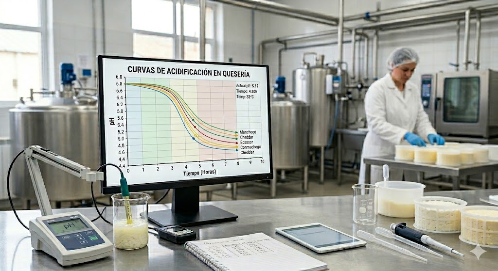

Hay un dato que todo quesero registra y pocos analizan con la profundidad que merece: la curva de descenso del pH durante la elaboración. No es un simple indicador de control — es la firma dinámica del fermento, la huella del proceso, y el mejor predictor de la textura final que tenemos disponible en tiempo real. En este artículo explico cómo he aplicado modelos matemáticos sigmoidales a datos reales de fabricación, qué información extraemos de sus parámetros, y cómo decidir qué modelo usar según los datos disponibles.


## Por qué la curva de acidificación importa más de lo que parece

Durante las primeras horas de elaboración, los fermentos lácticos convierten la lactosa en ácido láctico. El pH desciende desde ~6,8 en la leche hasta valores que en una pasta prensada se sitúan entre 5,1 y 5,4, y que en pastas blandas o quesos azules pueden llegar a 4,6–4,9. Este descenso no es solo un indicador de actividad bacteriana: controla tres procesos simultáneos con consecuencias tecnológicas directas.

El primero es la **desmineralización de la cuajada**. A medida que el pH desciende, el calcio coloidal asociado a la red de caseína se solubiliza y pasa al suero. La cuajada pierde rigidez progresivamente y adquiere las propiedades reológicas características del queso maduro. Aquí hay una paradoja que conviene entender bien: una acidificación rápida no produce más desmineralización, sino menos. Cuando el pH baja deprisa, la cuajada atraviesa cada intervalo de pH en menos tiempo, y la solubilización del calcio — que es un proceso dependiente del tiempo — queda incompleta. El resultado es una pasta más elástica, más gomosa, con menor fundibilidad. Una acidificación lenta, con más tiempo en cada valor de pH, produce una desmineralización más completa y una textura más abierta y friable. En tecnologías de pasta blanda o queso azul, esa mayor aptitud para la proteólisis es precisamente lo que se busca: la solubilización del calcio coloidal reduce la rigidez de la matriz de paracaseína y la hace más accesible a las enzimas proteolíticas, de modo que la desmineralización durante la elaboración actúa como condición previa necesaria para la proteólisis primaria durante la maduración [@Lucey1993; @OMahony2005]. Es ese proceso proteolítico posterior — no la desmineralización en sí misma — el que favorece el desarrollo de las texturas fundentes y cremosas características de esas variedades.


El segundo proceso es el **control microbiológico**. La caída de pH es la barrera primaria contra patógenos como *Listeria monocytogenes*, *Staphylococcus aureus* o coliformes. La velocidad con que se alcanza el pH inhibidor es tan importante como el pH final: un arranque lento da tiempo a que la flora indeseable se establezca antes de que la acidez la frene. Esto crea un dilema real entre textura y seguridad que analizaré más adelante.

El tercero es la **regulación de enzimas proteolíticas**. La quimosina residual del cuajo, la plasmina de la leche y las enzimas microbianas tienen actividades muy dependientes del pH. El perfil de acidificación determina en buena medida qué proteólisis ocurrirá durante la maduración, y con ella el desarrollo del sabor y la textura a largo plazo.

Conocer la curva entera — no solo el pH final — es conocer el proceso.


## El modelo de Gompertz: cuatro parámetros con significado tecnológico

El modelo de Gompertz invertido describe el descenso del pH como:

$$\text{pH}(t) = K + (A - K) \cdot \exp\!\bigl(-\exp(r \cdot (t - t_0))\bigr)$$

Es una función sigmoide con cuatro parámetros, y cada uno tiene una interpretación directa en el proceso:


**A** es el pH inicial, en el momento de inocular los fermentos. Refleja el estado de la leche — su carga microbiana, su historial de refrigeración, su acidez de partida. Fabricaciones con A sistemáticamente distinto entre lotes son una señal de irregularidad en la materia prima.

**K** es el pH final al que converge la curva — la asíntota inferior, el pH al que llegará la cuajada al término de la acidificación activa. Es el parámetro tecnológicamente más relevante porque determina el grado total de desmineralización y, con él, la textura y el comportamiento del queso en maduración. En pasta prensada, K entre 5,15 y 5,25 indica una acidificación correcta; por encima de 5,25, acidificación incompleta; por debajo de 5,15, sobreacidificación. Una K anormalmente alta acompañada de Vmax baja es una señal de alerta: puede indicar bloqueo del fermento por fagos, inhibidores en la leche (antibióticos, residuos de detergentes) o competencia con flora contaminante. Conviene tener presente, no obstante, que una K elevada no siempre refleja un fermento lento — puede ser consecuencia de una alta capacidad tampón de la leche (por concentración mediante ultrafiltración, alto contenido en caseína o calcio coloidal elevado), que frena el descenso de pH con independencia de la actividad bacteriana [@McSweeney2007]. Distinguir ambas causas requiere comparar K con la tasa de producción de ácido láctico, no solo con el pH.

**t₀** es el tiempo en que ocurre la máxima velocidad de descenso — el punto de inflexión de la sigmoide. Es el parámetro más útil para la planificación del proceso: anticipa cuándo llegará la fase de máxima actividad bacteriana y permite programar el moldeo, el prensado y la entrada en salmuera con criterio en lugar de por intuición o costumbre.

**r** controla la brusquedad de la caída. Una r alta produce una curva estrecha y empinada; una r baja, una caída lenta y prolongada. Como veremos, r no es comparable directamente entre modelos distintos — pero dentro del mismo modelo es un indicador válido de la intensidad de la cinética.

De r se deriva el parámetro quizás más útil para comparar fabricaciones: **Vmax**, la velocidad máxima de descenso del pH, en unidades de pH/hora. En Gompertz:

$$V_{max} = \frac{r \cdot (A - K)}{e}$$

Es la métrica correcta para comparar entre lotes o entre cepas la intensidad de la acidificación, independientemente del pH inicial o final.

```{r}
#| label: fig-gompertz-anotada
#| fig-cap: "Curva de acidificación — modelo de Gompertz con parámetros anotados. Las dos curvas ilustran el contraste entre una acidificación rápida (azul, r = 0,58 h⁻¹, Vmax = 0,538 pH/h, t₀ = 5,1 h) y una lenta (roja, r = 0,25 h⁻¹, Vmax = 0,232 pH/h, t₀ = 11,8 h). Ambas alcanzan el mismo pH final (K = 4,36)."
#| warning: true
#| message: true

library(ggplot2)

# ── Parámetros de dos curvas representativas ─────────────────────────────────
# Mismo A, K y pH inicial — solo varía r
# t0 se calcula para que gompertz(0, A, K, r, t0) = pH_ini

A       <- 6.88
K       <- 4.36
pH_ini  <- 6.75   # pH en t = 0, igual para ambas curvas

# t0 = -log(-log((pH_ini - K) / (A - K))) / r
calc_t0 <- function(A, K, r, pH_ini) {
  -log(-log((pH_ini - K) / (A - K))) / r
}

curvas <- list(
  list(label = "r alto", A = A, K = K, r = 0.58,
       t0 = calc_t0(A, K, 0.58, pH_ini), color = "#2E75B6"),
  list(label = "r bajo",  A = A, K = K, r = 0.25,
       t0 = calc_t0(A, K, 0.25, pH_ini), color = "#C00000")
)

# ── Función de Gompertz ───────────────────────────────────────────────────────
gompertz <- function(t, A, K, r, t0) {
  K + (A - K) * exp(-exp(r * (t - t0)))
}

# ── Parámetros derivados ──────────────────────────────────────────────────────
vmax  <- function(A, K, r) r * (A - K) / exp(1)
ph_t0 <- function(A, K)    K + (A - K) / exp(1)   # pH en el punto de inflexión

# ── Datos para las curvas ─────────────────────────────────────────────────────
t_seq <- seq(0, 22, by = 0.05)

df <- do.call(rbind, lapply(curvas, function(cv) {
  data.frame(
    hora  = t_seq,
    pH    = gompertz(t_seq, cv$A, cv$K, cv$r, cv$t0),
    label = cv$label,
    color = cv$color
  )
}))

# ── Puntos de anotación por curva ─────────────────────────────────────────────
anot <- do.call(rbind, lapply(curvas, function(cv) {
  vm  <- vmax(cv$A, cv$K, cv$r)
  pht <- ph_t0(cv$A, cv$K)
  data.frame(
    label  = cv$label,
    color  = cv$color,
    t0     = cv$t0,
    ph_t0  = pht,
    vmax   = vm,
    A      = cv$A,
    K      = cv$K,
    r      = cv$r
  )
}))

# ── Segmentos para la tangente en t0 ─────────────────────────────────────────
# La tangente tiene pendiente -Vmax (negativa porque el pH baja)
# y pasa por (t0, pH(t0))
tangente <- do.call(rbind, lapply(curvas, function(cv) {
  vm  <- vmax(cv$A, cv$K, cv$r)
  pht <- ph_t0(cv$A, cv$K)
  dt  <- 1.8  # extensión de la tangente a cada lado
  data.frame(
    label = cv$label,
    color = cv$color,
    x     = cv$t0 - dt,
    xend  = cv$t0 + dt,
    y     = pht + vm * dt,
    yend  = pht - vm * dt
  )
}))

# ── Etiquetas de texto ────────────────────────────────────────────────────────
etiquetas <- do.call(rbind, lapply(curvas, function(cv) {
  vm  <- vmax(cv$A, cv$K, cv$r)
  pht <- ph_t0(cv$A, cv$K)
  data.frame(
    label = cv$label,
    color = cv$color,
    # Etiqueta A (asíntota superior) — a la izquierda
    t_A   = 0.4,
    ph_A  = cv$A + 0.06,
    txt_A = paste0("A = ", cv$A),
    # Etiqueta K (asíntota inferior) — a la derecha
    t_K   = 19.5,
    ph_K  = cv$K - 0.09,
    txt_K = paste0("K = ", cv$K),
    # Etiqueta t0
    t_t0      = ifelse(cv$label == "r alto",  6.0, 13.0),
    ph_t0_lbl = ifelse(cv$label == "r alto",  5.2,  5.2),
    txt_t0 = paste0("t0 = ", round(cv$t0, 3), " h"),
    # Etiqueta Vmax
    t_vm  = ifelse(cv$label == "r alto",  5.2, 11.2),
    ph_vm = ifelse(cv$label == "r alto",  5.6,  5.6),
    txt_vm = paste0("Vmax = ", round(vm, 3), " pH/h"),
    # Etiqueta r (junto al nombre de la curva)
    t_r   = ifelse(cv$label == "r alto", 0.8, 5),
    ph_r  = ifelse(cv$label == "r alto", 6.2, gompertz(1.0, cv$A, cv$K, cv$r, cv$t0) - 0.1),
    txt_r = paste0(cv$label, "\nr = ", cv$r, " h\u207b\u00b9")
  )
}))

# ── Gráfico ───────────────────────────────────────────────────────────────────
ggplot() +

  # Líneas de asíntota A y K (una sola, compartida porque A y K son iguales)
  geom_hline(yintercept = curvas[[1]]$A, linetype = "dotted", color = "gray50", linewidth = 0.5) +
  geom_hline(yintercept = curvas[[1]]$K, linetype = "dotted", color = "gray50", linewidth = 0.5) +

  # Curvas principales
  geom_line(data = df,
            aes(x = hora, y = pH, color = label),
            linewidth = 1.1) +

  # Tangentes en t0
  geom_segment(data = tangente,
               aes(x = x, xend = xend, y = y, yend = yend, color = label),
               linetype = "dashed", linewidth = 0.6) +

  # Puntos en t0
  geom_point(data = anot,
             aes(x = t0, y = ph_t0, color = label),
             size = 3, shape = 21, fill = "white", stroke = 1.5) +

  # Segmentos verticales hasta el eje X para t0
  geom_segment(data = anot,
               aes(x = t0, xend = t0, y = K - 0.05, yend = ph_t0, color = label),
               linetype = "dotted", linewidth = 0.5) +

  # Etiquetas de texto — A y K (solo una vez, en gris)
  geom_text(data = etiquetas[etiquetas$label == "r alto", ],
            aes(x = t_A, y = ph_A, label = txt_A),
            hjust = 0, size = 3.2, color = "gray40") +
  geom_text(data = etiquetas[etiquetas$label == "r alto", ],
            aes(x = t_K, y = ph_K, label = txt_K),
            hjust = 1, size = 3.2, color = "gray40") +

  # Etiquetas t0 por curva
  geom_text(data = etiquetas,
            aes(x = t_t0, y = ph_t0_lbl, label = txt_t0, color = label),
            hjust = 0, size = 3.0) +

  # Etiquetas Vmax por curva
  geom_text(data = etiquetas,
            aes(x = t_vm, y = ph_vm, label = txt_vm, color = label),
            hjust = 0, size = 3.0) +

  # Etiquetas r/nombre de curva
  geom_text(data = etiquetas,
            aes(x = t_r, y = ph_r, label = txt_r, color = label),
            hjust = 0, size = 3.0, lineheight = 0.9) +

  scale_color_manual(values = setNames(
    sapply(curvas, `[[`, "color"),
    sapply(curvas, `[[`, "label")
  )) +
  scale_x_continuous(breaks = seq(0, 22, by = 2), limits = c(0, 22)) +
  scale_y_continuous(breaks = seq(4.0, 7.2, by = 0.2), limits = c(4.0, 7.2)) +
  labs(
    title    = "Curva de acidificación — modelo de Gompertz",
    subtitle = expression(pH(t) == K + (A - K) %.% exp(-exp(r %.% (t - t[0])))),
    x        = "Tiempo (horas)",
    y        = "pH",
    color    = NULL
  ) +
  theme_bw(base_size = 11) +
  theme(
    legend.position  = "none",
    plot.subtitle    = element_text(color = "gray40", size = 9),
    panel.grid.minor = element_blank()
  )
# ggsave("curva_gompertz_anotada.png", width = 9, height = 5.5, dpi = 150)
# cat("Guardado: curva_gompertz_anotada.png\n")

```

La @fig-gompertz-anotada ilustra las dos situaciones contrapuestas. Ambas curvas alcanzan el mismo K (4,36), pero el tiempo que la cuajada pasa a cada pH intermedio es muy diferente — y con él, el grado de desmineralización.


## Las limitaciones de Gompertz: por qué la logística y Richards pueden ser mejores

Gompertz tiene una limitación estructural que conviene conocer: su punto de inflexión está fijado al 63,2% del descenso total (= 1 − 1/e). Es una restricción matemática intrínseca al modelo, no un resultado ajustado a los datos. Esto significa que Gompertz asume implícitamente que el fermento alcanza su máxima actividad cuando ya ha completado casi dos tercios de la caída total de pH. Esa hipótesis puede o no coincidir con la realidad de cada cepa y condición.

La **logística estándar** corrige parte de ese problema manteniendo la misma parsimonia — cuatro parámetros — pero situando el punto de inflexión al 50% del descenso, lo que en promedio resulta más próximo a la realidad de las cepas analizadas:

$$\text{pH}(t) = K + \frac{A - K}{1 + \exp(r \cdot (t - t_0))}$$

Y Vmax se calcula como r·(A−K)/4, una expresión más sencilla que la de Gompertz.

El **modelo de Richards** da un paso más: libera completamente la posición del punto de inflexión mediante un quinto parámetro, ν. Cuando ν → 0, Richards converge a Gompertz; cuando ν = 1, recupera la logística estándar. Para cualquier otro valor de ν, el modelo se adapta a la asimetría real de los datos. Esa flexibilidad tiene un coste: Richards necesita al menos 10–12 puntos bien distribuidos (arranque, caída activa y talón) para ajustar de forma estable.

Dos aspectos de la comparación entre modelos deben quedar claros para no incurrir en errores de interpretación:

**K es universal.** El pH final estimado es prácticamente idéntico en los tres modelos para los mismos datos — diferencias de 0,01–0,02 unidades, tecnológicamente irrelevantes. K puede compararse directamente entre modelos.

**r y Vmax son internos a cada modelo.** La logística estima siempre un r mayor que Gompertz para los mismos datos (r_logística ≈ 1,5–1,7 × r_Gompertz), porque ambos parámetros tienen escalas internas distintas. Lo mismo ocurre con Vmax. Mezclar parámetros de modelos distintos en la misma comparación de lotes o cepas produce conclusiones erróneas.


## Resultados reales: cuatro lotes de elaboración en prácticas de Formación Profesional

Para poner a prueba los modelos he trabajado con datos de cuatro lotes de fabricación de queso registrados en prácticas escolares de FP de Industrias Alimentarias. Cada lote tiene entre 7 y 12 medidas de pH distribuidas a lo largo del proceso. He ajustado Gompertz y logística a cada lote con `nls()` en R y comparado los ajustes mediante AIC [@Akaike1974; @Burnham2002] — el criterio de información de Akaike, una métrica estadística que valora el ajuste del modelo penalizando su complejidad; valores más negativos indican mejor ajuste para el mismo número de parámetros.

Los resultados de K cuentan la historia del proceso:

- **Lote 1** — K = 4,82: sobreacidificación. El fermento siguió activo más tiempo del previsto y la cuajada llegó a pH demasiado bajo.
- **Lotes 2 y 4** — K = 5,25: acidificación correcta para pasta prensada.
- **Lote 3** — K = 5,50: acidificación incompleta. El fermento no llegó al pH objetivo, posiblemente por temperatura insuficiente o por un problema con el cultivo.

Los dos modelos clasifican los cuatro lotes de forma idéntica — K coincide a 0,01–0,02 unidades. Donde difieren es en t₀, con la logística estimando el punto de inflexión sistemáticamente ~1 hora antes que Gompertz, y en Vmax, donde las diferencias son del 50% entre modelos. Ninguna de esas diferencias altera el diagnóstico tecnológico del lote, pero sí importan si se quieren comparar fabricaciones o publicar resultados — hay que usar siempre el mismo modelo.

En cuanto al AIC con estos datos escasos: Gompertz gana en dos lotes, logística en los otros dos, y en todos los casos las diferencias son menores de 5 unidades. Con pocos puntos, el AIC no discrimina — ambos modelos son estadísticamente equivalentes.

```{r}
#| label: tbl-lotesFP
#| fig-cap: "Tabla de parámetros de ajuste Gompertz (discontinuo) vs logística (continuo) sobre los 4 lotes de FP."
#| fig-align: "center"
#| width: "90%"
#| warning: false
#| message: false

# original en zip: logistica_lotes.R
# sesion claude: sesion-claude-2026-04-04-Artículo LinkedIn
# zip: sesion_gompertz_queso.zip
#
library(dplyr)
library(readr)
library(ggplot2)
library(lubridate)
library(knitr)

# ── Leer datos ────────────────────────────────────────────────────────────────
datos_raw <- read_csv2("curvas_acidificacion.csv",
                       locale = locale(encoding = "ISO-8859-1"),
                       show_col_types = FALSE)

# ── Calcular tiempo en horas desde adición de fermentos ──────────────────────
datos <- datos_raw |>
  filter(!is.na(pH), !is.na(hora_control)) |>
  mutate(
    hora_control = dmy_hm(hora_control),
    lote = factor(lote)
  ) |>
  group_by(lote) |>
  mutate(
    t0_ref = min(hora_control[punto_control == "fermentos"], na.rm = TRUE),
    hora   = as.numeric(difftime(hora_control, t0_ref, units = "hours"))
  ) |>
  filter(hora >= 0) |>
  ungroup()

# cat("Datos disponibles por lote:\n")
# print(datos |> count(lote))

# ── Modelos ───────────────────────────────────────────────────────────────────
gompertz  <- function(t, A, K, r, t0) K + (A-K)*exp(-exp(r*(t-t0)))
logistica <- function(t, A, K, r, t0) K + (A-K)/(1 + exp(r*(t-t0)))

ajustar <- function(df, modelo_fn, np) {
  A_ini  <- max(df$pH, na.rm=TRUE)
  K_ini  <- min(df$pH, na.rm=TRUE)
  t0_ini <- df$hora[which.min(diff(df$pH))]
  tryCatch(
    nls(pH ~ modelo_fn(hora, A, K, r, t0),
        data = df,
        start = list(A=A_ini, K=K_ini, r=0.5, t0=t0_ini),
        algorithm = "port",
        lower = list(A=5.0, K=3.5, r=0.001, t0=0),
        upper = list(A=7.5, K=7.0, r=1.0,   t0=max(df$hora)),
        control = nls.control(maxiter=500, tol=1e-7)),
    error = function(e) { message("Error lote ", df$lote[1], ": ", e$message); NULL }
  )
}

calc_stats <- function(m, nombre, df) {
  if (is.null(m)) return(tibble(modelo=nombre, A=NA, K=NA, r=NA, t0=NA, Vmax=NA, R2=NA, AIC=NA))
  cf <- coef(m)
  A <- cf["A"]; K <- cf["K"]; r <- cf["r"]; t0 <- cf["t0"]
  Vmax <- r*(A-K)/exp(1)
  n    <- nrow(df)
  rss  <- sum(residuals(m)^2)
  tss  <- sum((df$pH - mean(df$pH))^2)
  R2   <- 1 - rss/tss
  np   <- length(cf)
  s2   <- rss/(n-np)
  ll   <- -n/2*log(2*pi*s2) - rss/(2*s2)
  AIC  <- -2*ll + 2*np
  tibble(modelo=nombre,
         A=round(A,3), K=round(K,3), r=round(r,4), t0=round(t0,2),
         Vmax=round(Vmax,4), R2=round(R2,4), AIC=round(AIC,2))
}

# ── Ajustar por lote ──────────────────────────────────────────────────────────
#resultados <- datos |>
datos |> 
 group_by(lote) |>
  reframe({
    df <- pick(everything())
    mg <- ajustar(df, gompertz,  4)
    ml <- ajustar(df, logistica, 4)
    bind_rows(
      calc_stats(mg, "Gompertz",  df),
      calc_stats(ml, "Logistica", df)
    )
  }) |>
  kable()
```


```{r}
#| label: fig-lotesFP
#| fig-cap: "Ajuste Gompertz (discontinuo) vs logística (continuo) sobre los 4 lotes de FP. Con datos escasos, ambas curvas son visualmente indistinguibles y el AIC no discrimina entre ellas."
#| fig-align: "center"
#| width: "90%"
#| warning: false
#| message: false

# ── Predicciones ──────────────────────────────────────────────────────────────
pred_df <- datos |>
  group_by(lote) |>
  reframe({
    df    <- pick(everything())
    t_seq <- seq(0, max(df$hora), by=0.1)
    mg <- ajustar(df, gompertz,  4)
    ml <- ajustar(df, logistica, 4)
    bind_rows(
      if (!is.null(mg)) data.frame(hora=t_seq,
        pH=predict(mg, data.frame(hora=t_seq)), modelo="Gompertz"),
      if (!is.null(ml)) data.frame(hora=t_seq,
        pH=predict(ml, data.frame(hora=t_seq)), modelo="Logistica")
    )
  })

# ── Gráfico ───────────────────────────────────────────────────────────────────
ggplot() +
  geom_point(data = datos,
             aes(x=hora, y=pH),
             size=2, shape=21, fill="white", color="gray30", stroke=1) +
  geom_line(data = pred_df,
            aes(x=hora, y=pH, color=modelo, linetype=modelo),
            linewidth=0.9) +
  scale_color_manual(values=c("Gompertz"="#2E75B6", "Logistica"="#C00000")) +
  scale_linetype_manual(values=c("Gompertz"="dashed", "Logistica"="solid")) +
  scale_y_continuous(limits=c(4.5,7.2), breaks=seq(4.5,7.0,0.5)) +
  facet_wrap(~lote, ncol=2, labeller=label_both) +
  labs(title="Ajuste Gompertz vs Logística — datos reales FP",
       x="Tiempo desde adición de fermentos (horas)",
       y="pH", color="Modelo", linetype="Modelo") +
  theme_bw(base_size=10) +
  theme(legend.position="bottom",
        strip.background=element_rect(fill="#D6E4F0", color=NA),
        strip.text=element_text(face="bold"),
        panel.grid.minor=element_blank())

#ggsave("/tmp/ajuste_lotes_FP.png", width=8, height=6, dpi=150)
#cat("Gráfico guardado\n")

```


La @fig-lotesFP confirma lo que el AIC sugiere: con datos escasos, ambas curvas son visualmente indistinguibles. La elección entre Gompertz y logística en este contexto es, esencialmente, una cuestión de compatibilidad con la literatura que se quiera usar como referencia.

---

## Datos densos y cepas comerciales: cuando el modelo sí importa

Con mayor volumen de datos, la posibilidad de ajustar el modelo de Richards cambia la evaluación de los modelos.

Utilizando la herramienta [WebPlotDigitizer](https://automeris.io/WebPlotDigitizer), he digitalizado las curvas de pH publicadas por Danisco/IFF en las fichas técnicas de sus cepas MA y TA050 para tres temperaturas de trabajo en cada cepa — entre 80 y 90 puntos por curva, hasta 14 horas de proceso. Con esta densidad de datos, el AIC distingue con nitidez entre modelos.

Las curvas digitalizadas son estas:

```{r}
#| label: fig-combinadas
#| fig-cap: "Curvas de acidificación de las cepas MA y TA050 a diferentes temperaturas."
#| fig-align: "center"
#| fig-width: 12
#| fig-height: 5
#| out-width: "100%"
#| warning: false
#| message: false


library(tidyverse)
library(patchwork)

# --- Gráfico MA ---
datos_MA <- read_csv2(
  "curvas_danisco_MA_tidy.csv",
  locale = locale(encoding = "ISO-8859-1")
)

datos_MA$temperatura <- factor(datos_MA$temperatura, levels = c(25, 32, 37))

p1 <- ggplot(datos_MA, aes(x = hora, y = pH, color = temperatura)) +
  geom_line(linewidth = 1) +
  scale_color_manual(
    values = c("25" = "red", "32" = "blue", "37" = "green3"),
    labels = c("25°C", "32°C", "37°C")
  ) +
  scale_x_continuous(breaks = seq(0, 24, by = 1)) +
  scale_y_continuous(breaks = seq(4.0, 7.0, by = 0.2), limits = c(4.0, 7.0)) +
  labs(
    title = "Curvas de acidificación — Cepa MA (Danisco/IFF)",
    x = "Tiempo (horas)",
    y = "pH",
    color = "Temperatura"
  ) +
  theme_bw()

# --- Gráfico TA050 ---
datos_TA050 <- read_csv2(
  "curvas_danisco_TA050_tidy.csv",
  locale = locale(encoding = "ISO-8859-1")
)

datos_TA050$temperatura <- factor(datos_TA050$temperatura, levels = c(25, 32, 37))

p2 <- ggplot(datos_TA050, aes(x = hora, y = pH, color = temperatura)) +
  geom_line(linewidth = 1) +
  scale_color_manual(
    values = c("25" = "red", "32" = "blue", "37" = "green3"),
    labels = c("25°C", "32°C", "37°C")
  ) +
  scale_x_continuous(breaks = seq(0, 24, by = 1)) +
  scale_y_continuous(breaks = seq(4.0, 7.0, by = 0.2), limits = c(4.0, 7.0)) +
  labs(
    title = "Curvas de acidificación — Cepa TA050 (Danisco/IFF)",
    x = "Tiempo (horas)",
    y = "pH",
    color = "Temperatura"
  ) +
  theme_bw(base_size=10)

# --- Lado a lado ---
p1 + p2

```

He ajustado los tres modelos (Gompertz, logística y Richards) a cada combinación de cepa y temperatura; esta es la tabla general de parámetros:

```{r}
#| label: tbl-danisco-general
#| fig-cap: "Tabla de parámetros del ajuste de los diferentes modelos de curvas logísticas utiizados a las curvas de acidificacion tipo proporcionadas por Danisco/IFF para sus cepas MA y TA50."
#| fig-align: "center"
#| width: "90%"
#| warning: false
#| message: false

library(dplyr)
library(readr)
library(ggplot2)
library(tidyr)
library(gt)

# ── Leer datos ────────────────────────────────────────────────────────────────
datos <- read_csv2("curvas-pH-Danisco.csv",
                   locale = locale(encoding = "ISO-8859-1"),
                   show_col_types = FALSE) |>
  mutate(cepa = factor(cepa), temperatura = factor(temperatura))

# ── Limitar a zona de acidificación activa (hasta 14 h) ──────────────────────
T_MAX <- 14
datos_act <- datos |> filter(hora <= T_MAX)

# ── Modelos ───────────────────────────────────────────────────────────────────

# Gompertz invertido
gompertz <- function(t, A, K, r, t0) {
  K + (A - K) * exp(-exp(r * (t - t0)))
}

# Logística estándar (punto de inflexión al 50% de amplitud)
logistica <- function(t, A, K, r, t0) {
  K + (A - K) / (1 + exp(r * (t - t0)))
}

# Richards generalizada (nu libre: nu=1 → logística, nu→0 → Gompertz)
richards <- function(t, A, K, r, t0, nu) {
  K + (A - K) * (1 + nu * exp(r * (t - t0)))^(-1/nu)
}

# ── Función de ajuste para un grupo ──────────────────────────────────────────
ajustar_grupo <- function(df) {
  A_ini  <- max(df$pH)
  K_ini  <- min(df$pH)
  t0_ini <- df$hora[which.min(diff(df$pH))]

  # Gompertz
  m_gomp <- tryCatch(
    nls(pH ~ gompertz(hora, A, K, r, t0),
        data = df,
        start = list(A = A_ini, K = K_ini, r = 0.5, t0 = t0_ini),
        algorithm = "port",
        lower = list(A = 5.0, K = 3.5, r = 0.01, t0 = 0),
        upper = list(A = 7.5, K = 6.5, r = 5.0, t0 = T_MAX),
        control = nls.control(maxiter = 500)),
    error = function(e) NULL)

  # Logística
  m_log <- tryCatch(
    nls(pH ~ logistica(hora, A, K, r, t0),
        data = df,
        start = list(A = A_ini, K = K_ini, r = 0.5, t0 = t0_ini),
        algorithm = "port",
        lower = list(A = 5.0, K = 3.5, r = 0.01, t0 = 0),
        upper = list(A = 7.5, K = 6.5, r = 5.0, t0 = T_MAX),
        control = nls.control(maxiter = 500)),
    error = function(e) NULL)

  # Richards
  m_rich <- tryCatch(
    nls(pH ~ richards(hora, A, K, r, t0, nu),
        data = df,
        start = list(A = A_ini, K = K_ini, r = 0.5, t0 = t0_ini, nu = 1.0),
        algorithm = "port",
        lower = list(A = 5.0, K = 3.5, r = 0.01, t0 = 0,     nu = 0.01),
        upper = list(A = 7.5, K = 6.5, r = 5.0,  t0 = T_MAX, nu = 10.0),
        control = nls.control(maxiter = 1000)),
    error = function(e) NULL)

  calc_stats <- function(m, nombre, np) {
    if (is.null(m)) return(tibble(modelo = nombre, AIC = NA, BIC = NA, R2 = NA, K = NA, r = NA))
    n   <- nrow(df)
    rss <- sum(residuals(m)^2)
    tss <- sum((df$pH - mean(df$pH))^2)
    R2  <- 1 - rss / tss
    # AIC y BIC manuales (nls no los calcula directamente)
    sigma2 <- rss / (n - np)
    loglik <- -n/2 * log(2 * pi * sigma2) - rss / (2 * sigma2)
    AIC_m  <- -2 * loglik + 2 * np
    BIC_m  <- -2 * loglik + log(n) * np
    tibble(
      modelo = nombre,
      AIC    = round(AIC_m, 2),
      BIC    = round(BIC_m, 2),
      R2     = round(R2, 4),
      K      = round(coef(m)["K"], 3),
      r      = round(coef(m)["r"], 4)
    )
  }

  bind_rows(
    calc_stats(m_gomp, "Gompertz",  4),
    calc_stats(m_log,  "Logistica", 4),
    calc_stats(m_rich, "Richards",  5)
  )
}

# ── Aplicar por cepa × temperatura ───────────────────────────────────────────
resultados <- datos_act |>
  group_by(cepa, temperatura) |>
  reframe(ajustar_grupo(pick(everything())))

#cat("\n=== COMPARACIÓN DE MODELOS (datos hasta", T_MAX, "h) ===\n")
resultados |> 
  gt()

```

Si extraemos los datos de AIC para cada modelo y temperatura, 
```{r}
#| label: tbl-aic
#| fig-cap: "Comparación AIC de los tres modelos sobre datos Danisco/IFF (t ≤ 14 h). Valores más negativos indican mejor ajuste. En negrita el mejor modelo en cada caso."
#| fig-align: "center"
#| width: "90%"
#| warning: false
#| message: false

resultados |>
  select(cepa, temperatura, modelo, AIC) %>%
  pivot_wider(
    names_from = modelo,
    values_from = AIC
  ) |>
  gt() |>
  tab_style(
    style = cell_text(weight = "bold"),
    locations = cells_body(columns = Richards)
  )

```


Las diferencias son categóricas. En AIC, una diferencia superior a 10 unidades ya se considera muy significativa — aquí estamos hablando de diferencias de 50 a 150 unidades. Richards gana en los seis casos. La logística supera a Gompertz en cinco de los seis, con la excepción de MA a 37°C donde ambos empatan aproximadamente.

```{r}
#| label: fig-aic
#| fig-cap: "Comparación AIC por modelo, cepa y temperatura (datos Danisco/IFF, t ≤ 14 h). La barra verde (Richards) es sistemáticamente la más negativa en todos los paneles."
#| fig-align: "center"
#| width: "90%"
#| warning: false
#| message: false

# ── Gráfico: AIC por modelo, cepa y temperatura ───────────────────────────────
res_ok <- resultados |> filter(!is.na(AIC))

ggplot(res_ok, aes(x = modelo, y = AIC, fill = modelo)) +
  geom_col(alpha = 0.85, width = 0.6) +
  geom_text(aes(label = round(AIC, 1)), vjust = -0.4, size = 3) +
  facet_grid(cepa ~ temperatura, labeller = label_both) +
  scale_fill_manual(values = c(
    "Gompertz"  = "#2E75B6",
    "Logistica" = "#C00000",
    "Richards"  = "#70AD47"
  )) +
  labs(title = "Comparación de modelos — AIC por cepa y temperatura",
       subtitle = paste("Datos limitados a t \u2264", T_MAX, "h"),
       x = NULL, y = "AIC", fill = NULL) +
  theme_bw(base_size = 10) +
  theme(legend.position = "bottom",
        panel.grid.major.x = element_blank(),
        strip.background = element_rect(fill = "#D6E4F0", color = NA),
        strip.text = element_text(face = "bold"))

```


La mejora de la logística sobre Gompertz (@fig-aic) se produce con los mismos cuatro parámetros — no hay penalización adicional por complejidad. Es puramente una cuestión de forma: el 50% de inflexión de la logística describe mejor la cinética real de estas cepas que el 63,2% de Gompertz.

Richards mejora sobre la logística gracias a ν, que captura la asimetría real de cada curva. Los parámetros Richards revelan diferencias biológicas sustantivas entre las dos cepas:


```{r}
#| label: fig-ajuste-Danisco
#| fig-cap: "Ajuste Gompertz (línea discontinua) vs Richards (línea continua) a tres temperaturas(t \u2264 14 h).\n  Cepa MA: Las diferencias entre modelos son visibles sobre todo en la zona de arranque y en el talón.\n Cepa TA050: Gompertz subestima sistemáticamente el pH en la fase inicial y lo sobreestima en el talón, consecuencia de que la asimetría real de la curva no coincide con la asimetría fija del modelo."
#| fig-width: 12
#| fig-height: 5
#| out-width: "100%"
#| warning: false
#| message: false


library(dplyr)
library(readr)
library(ggplot2)

# Predicciones Richards y Gompertz para comparar visualmente
ajustar_gomp <- function(df) {
  A_ini  <- max(df$pH); K_ini <- min(df$pH)
  t0_ini <- df$hora[which.min(diff(df$pH))]
  tryCatch(
    nls(pH ~ gompertz(hora, A, K, r, t0), data = df,
        start = list(A=A_ini, K=K_ini, r=0.5, t0=t0_ini),
        algorithm="port",
        lower=list(A=5.0,K=3.5,r=0.01,t0=0),
        upper=list(A=7.5,K=6.5,r=5.0,t0=T_MAX),
        control=nls.control(maxiter=500)), error=function(e) NULL)
}
ajustar_rich <- function(df) {
  A_ini  <- max(df$pH); K_ini <- min(df$pH)
  t0_ini <- df$hora[which.min(diff(df$pH))]
  tryCatch(
    nls(pH ~ richards(hora, A, K, r, t0, nu), data = df,
        start = list(A=A_ini, K=K_ini, r=0.5, t0=t0_ini, nu=1.0),
        algorithm="port",
        lower=list(A=5.0,K=3.5,r=0.01,t0=0,nu=0.01),
        upper=list(A=7.5,K=6.5,r=5.0,t0=T_MAX,nu=10.0),
        control=nls.control(maxiter=1000)), error=function(e) NULL)
}

pred_df <- do.call(rbind, lapply(split(datos_act,
    paste(datos_act$cepa, datos_act$temperatura)), function(df) {
  mg <- ajustar_gomp(df)
  mr <- ajustar_rich(df)
  t_seq <- seq(0, T_MAX, by = 0.05)
  rbind(
    if (!is.null(mg)) data.frame(hora=t_seq, pH=predict(mg, data.frame(hora=t_seq)),
      modelo="Gompertz", cepa=df$cepa[1], temperatura=df$temperatura[1]),
    if (!is.null(mr)) data.frame(hora=t_seq, pH=predict(mr, data.frame(hora=t_seq)),
      modelo="Richards", cepa=df$cepa[1], temperatura=df$temperatura[1])
  )
}))

colores_temp <- c("25"="#E63946", "32"="#457B9D", "37"="#2D6A4F", "40"="#E9C46A")
lty_modelo   <- c("Gompertz"="dashed", "Richards"="solid")

# Gráfico MA
p_MA <- ggplot() +
  geom_point(data = datos_act |> filter(cepa=="MA"),
             aes(x=hora, y=pH, color=temperatura), size=1.2, alpha=0.5) +
  geom_line(data = pred_df |> filter(cepa=="MA"),
            aes(x=hora, y=pH, color=temperatura, linetype=modelo), linewidth=0.9) +
  scale_color_manual(values=colores_temp) +
  scale_linetype_manual(values=lty_modelo) +
  scale_x_continuous(breaks=seq(0,14,2)) +
  scale_y_continuous(limits=c(4.0,7.0), breaks=seq(4.0,7.0,0.2)) +
  labs(title="Cepa MA",
       x="Tiempo (horas)", y="pH", color="T\u00aa (\u00b0C)", linetype="Modelo") +
  theme_bw(base_size=10) +
  theme(legend.position="right",
        strip.background=element_rect(fill="#D6E4F0",color=NA))

# Gráfico TA050
p_TA <- ggplot() +
  geom_point(data = datos_act |> filter(cepa=="TA050"),
             aes(x=hora, y=pH, color=temperatura), size=1.2, alpha=0.5) +
  geom_line(data = pred_df |> filter(cepa=="TA050"),
            aes(x=hora, y=pH, color=temperatura, linetype=modelo), linewidth=0.9) +
  scale_color_manual(values=colores_temp) +
  scale_linetype_manual(values=lty_modelo) +
  scale_x_continuous(breaks=seq(0,14,2)) +
  scale_y_continuous(limits=c(4.0,7.5), breaks=seq(4.0,7.5,0.2)) +
  labs(title="Cepa TA050",
       x="Tiempo (horas)", y="pH", color="T\u00aa (\u00b0C)", linetype="Modelo") +
  theme_bw(base_size=10) +
  theme(legend.position="right",
        strip.background=element_rect(fill="#D6E4F0",color=NA))

p_MA + p_TA
```


**Cepa MA** — ν oscila entre 0,36 (a 37°C, comportamiento cercano a Gompertz, inflexión al 42,5% del descenso) y 1,45 (a 25°C, cercano a la logística, inflexión al 54%). Vmax es alta: 1,18–1,53 pH/h. La curva MA es relativamente simétrica, lo que explica que la logística la ajuste casi tan bien como Richards.

**Cepa TA050** — ν es llamativamente alto: 3,3 a 32°C, llegando a 6,6 a 40°C. La inflexión ocurre al 64–73% del descenso. La curva cae relativamente deprisa en la primera mitad y luego se frena de forma pronunciada — el fermento tiene una fase de alta actividad que se agota pronto, seguida de una larga fase residual. Vmax es baja (0,37–0,71 pH/h) y K es muy sensible a la temperatura, con diferencias de más de 0,5 unidades entre 32°C y 40°C.

## Qué modelo usar según el contexto

La elección del modelo debe depender de los datos disponibles y del objetivo del análisis, no de la costumbre o del software instalado.

**Con datos escasos (menos de 10 puntos):** Gompertz y logística son equivalentes desde el punto de vista estadístico. Si el único objetivo es clasificar el lote por K, cualquiera de los dos sirve. Si se van a comparar velocidades de acidificación entre lotes, la logística tiene la ventaja de una fórmula de Vmax más sencilla. Si el trabajo necesita ser comparable con la literatura existente en microbiología predictiva — donde Gompertz es el modelo dominante desde el trabajo fundacional de Zwietering et al. (1990) — Gompertz es la elección natural.

**Con datos entre 6 y 10 puntos bien distribuidos:** la logística tiene una ventaja promedio sobre Gompertz, pero la diferencia no es grande. En este rango empieza a tener sentido intentar Richards si los puntos cubren bien el arranque, la caída activa y el talón.

**Con datos densos (más de 10–12 puntos con buena cobertura de las tres zonas):** Richards es el modelo de referencia y no hay razón para usar los otros dos.

**Para control de proceso en planta:** aquí la prioridad no es el ajuste estadístico óptimo sino la robustez operativa. Con las medidas que un quesero puede tomar de forma no invasiva durante el proceso (6–8 puntos), Gompertz o logística con estimación en tiempo real de K y t₀ son herramientas perfectamente prácticas. El verdadero valor de estos modelos en planta no está en el AIC — está en que permiten extrapolar la curva antes de que termine el proceso y anticipar si el lote va a alcanzar el pH objetivo.

Una advertencia que no debe perderse de vista: **no mezclar parámetros de modelos distintos en la misma comparación**. K es universal entre modelos; r y Vmax son internos a cada uno. Si en un seguimiento longitudinal algunos lotes se ajustaron con Gompertz y otros con logística, los valores de r y Vmax no son comparables directamente.


## De la curva a la decisión: aplicaciones prácticas

### La hoja de parámetros como herramienta de gestión

El valor más inmediato de modelizar la acidificación no está en la elegancia matemática sino en lo que permite hacer después: reducir una curva entera a cuatro o cinco números con significado tecnológico preciso y registrarlos en la hoja de datos de fabricación junto al resto de variables del lote.

Cada fabricación queda así caracterizada por su A, su K, su t₀ y su Vmax. Acumulados a lo largo de meses y años, esos registros permiten construir algo que en la quesería industrial rara vez existe de forma explícita: un histórico cuantitativo del comportamiento del fermento en las condiciones reales de planta. Con ese histórico se puede hacer análisis de tendencias (¿está cambiando lentamente la velocidad de acidificación?), detección de anomalías (¿por qué este lote tiene una K 0,15 unidades más alta que la media?) y, sobre todo, correlación con otras variables de proceso y de producto.

La extensión más directa de ese registro es establecer la relación entre los parámetros de acidificación y las características organolépticas del queso — sobre todo textura, pero también sabor. La desmineralización, que depende del tiempo integrado a cada pH, está gobernada por la forma completa de la curva, no solo por K. Dos lotes con la misma K pero distinta Vmax han tenido perfiles de desmineralización diferentes y producirán quesos con texturas distintas. Cuantificar esa relación — construir modelos que predigan la elasticidad o la cremosidad de la pasta a partir de los parámetros de acidificación — es un objetivo alcanzable con datos de planta suficientemente sistemáticos, y que conecta el análisis cinético con la evaluación sensorial de forma directa.

De ahí se sigue la definición de **límites operativos para la curva de acidificación**: no solo un rango aceptable para K, sino también umbrales para Vmax (acidificaciones demasiado lentas comprometen la seguridad; demasiado rápidas comprometen la textura), una ventana para t₀ compatible con la planificación del moldeo, y un valor de A que refleje la calidad estándar de la leche de entrada. Esos límites constituyen la especificación cuantitativa del proceso de acidificación, y son la base de un sistema de control real — no de un simple registro post hoc.

### Sustitución de cepas: cómo mantener el mismo perfil de acidificación

Uno de los escenarios donde estos modelos resultan más útiles en la práctica es la sustitución de un cultivo por otro — ya sea por cambio de proveedor, por problemas de suministro, por retirada de un producto del mercado, o por la búsqueda de una optimización económica. La pregunta que el quesero necesita responder es: ¿produce el nuevo fermento el mismo perfil de acidificación que el anterior en mis condiciones de trabajo?

La respuesta intuitiva suele ser comparar los pH a puntos fijos del proceso — a las 4 horas, a las 8 horas, al final del prensado. Esa comparación es útil pero incompleta: dos curvas pueden coincidir en esos puntos y diferir significativamente en la forma de la transición. El enfoque correcto es ajustar el modelo a ambas cepas en condiciones equivalentes y comparar los parámetros directamente.

La comparación relevante opera en tres niveles:

**K** es el criterio primario. Si el nuevo fermento produce una K significativamente distinta a la del fermento de referencia en las mismas condiciones de temperatura y dosis, el queso resultante tendrá un grado de desmineralización diferente y, con él, una textura diferente. Una diferencia de 0,1–0,2 unidades en K es tecnológicamente relevante. Este parámetro es el más difícil de compensar porque depende de las características metabólicas intrínsecas de la cepa — su pH de inhibición, su capacidad tampón — y no puede corregirse fácilmente ajustando temperatura o dosis; una posibilidad es el ajuste de los niveles de lactosa mediante un delactosado controlado o una diálisis inicial.

**t₀ y Vmax** determinan si el nuevo fermento es compatible con la planificación del proceso. Un fermento que alcanza su máxima actividad dos horas más tarde que el anterior desincroniza el moldeo con la actividad bacteriana. Un fermento con Vmax muy superior puede generar una cuajada con menos calcio soluble de lo esperado, con la consiguiente alteración de textura. Estos parámetros son más manejables: t₀ puede desplazarse ajustando la temperatura de cuba o la dosis de inoculación; Vmax puede modularse dentro de ciertos límites con las mismas palancas.

**ν** (si se trabaja con Richards) añade una dimensión adicional: la forma de la transición. Dos cepas con K, t₀ y Vmax similares pero ν muy distintos producen dinámicas de desmineralización diferentes porque el tiempo que la cuajada pasa en cada rango de pH no es el mismo. Es un nivel de análisis que solo es accesible con datos suficientemente densos, pero que puede explicar diferencias organolépticas que los parámetros básicos no capturan.

El procedimiento práctico para una sustitución controlada sería: realizar un mínimo de tres fabricaciones paralelas con el fermento de referencia y el candidato a sustituto, en condiciones idénticas de temperatura, dosis y leche de partida; ajustar el modelo elegido a cada curva; comparar los parámetros con sus intervalos de confianza. Si K coincide dentro del margen de variabilidad habitual del proceso — que el histórico de datos permite conocer — y t₀ y Vmax son compatibles con la planificación existente, la sustitución es tecnológicamente segura. Si no coinciden, los parámetros indican exactamente dónde y en qué magnitud hay que compensar.

Este mismo enfoque es aplicable al cambio de formato de fermento — de liofilizado a congelado, de inoculación directa (DVS) a fermento madre — donde las diferencias no están en la cepa sino en el estado fisiológico de los microorganismos en el momento de la inoculación, lo que afecta fundamentalmente al t₀ y al arranque de la curva. Los cultivos DVS presentan con frecuencia una fase de latencia inicial al añadirse a la leche que no existe en el fermento madre activo, lo que se traduce en un t₀ sistemáticamente más tardío para la misma cepa en formato concentrado [@McSweeney2007]; el modelo lo captura directamente y permite cuantificar esa diferencia antes de decidir si es tecnológicamente aceptable.


## El dilema seguridad–textura y cómo resolverlo

Una acidificación lenta (r bajo, Vmax baja) favorece la textura porque permite una desmineralización más completa. Pero también significa más tiempo a pH moderado durante las primeras horas — exactamente el rango en que coliformes y estafilococos pueden crecer antes de que el pH los inhiba. La consecuencia no es solo microbiológica: estos microorganismos producen hidrógeno a partir del formiato, producto de la fermentación del lactato, lo que en quesos de pasta prensada o en salmuera se traduce en ojos irregulares, grietas o incluso hinchazón de la corteza — un defecto tecnológico visible que delata el problema antes de que el análisis microbiológico lo confirme [@McSweeney2007].

La solución no está en forzar una acidificación rápida a costa de la textura, sino en aplicar barreras múltiples independientes del pH: partir de una leche con carga coliforme baja (menos de 10 UFC/ml), usar cultivos adjuntos bacteriocinogénicos que actúen desde el arranque independientemente del pH, y valorar la preacidificación cuando el riesgo es alto — bajar el pH 0,1–0,2 unidades antes del fermento principal reduce el inóculo de partida sin alterar significativamente la cinética posterior. Estas estrategias permiten optimizar la curva de acidificación para la textura sin sacrificar la seguridad microbiológica, pero deben ser verificadas en las condiciones reales de producción mediante una experimentación correctamente diseñada, que puede ser perfectamente compatible con la fabricación industrial.


## Conclusión

La curva de acidificación contiene más información de la que habitualmente se extrae. Los cuatro parámetros de Gompertz o de la logística — A, K, t₀ y Vmax — son suficientes para diagnosticar el estado de un lote, comparar cepas o fermentos, detectar desviaciones de proceso y anticipar el comportamiento de la cuajada antes de que el proceso termine. Con datos densos, Richards añade la descripción de la asimetría de la curva, lo que permite distinguir dinámicas bacterianas que los modelos simétricos no pueden capturar.

El modelo de Gompertz lleva más de tres décadas siendo el estándar en microbiología predictiva porque es robusto, parsimonioso y bien documentado. Esas virtudes siguen siendo válidas. Pero hay situaciones — cuando los datos lo permiten — en que la logística o Richards lo superan con claridad. Conocer las condiciones de esa superación es lo que permite elegir con criterio en lugar de por inercia.

Si trabajas con datos de acidificación y quieres explorar estos modelos, el código completo en R está disponible. Los datos de cepas Danisco/IFF proceden de digitalización de sus fichas técnicas públicas. Cualquier comentario técnico o corrección es bienvenido.

## Referencias

:::{#refs}
:::

#### Nota
La redacción y revisión formal del artículo ha utilizado el apoyo de Claude Sonnet 4.6 (Anthropic, abril 2025).


