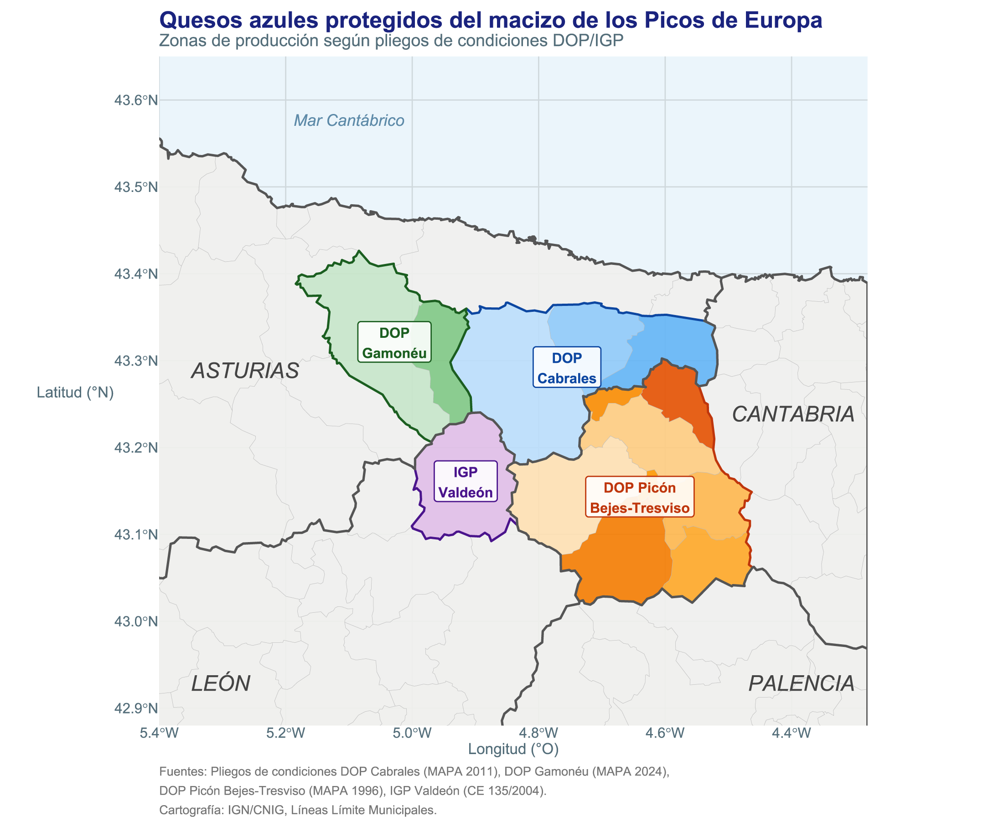
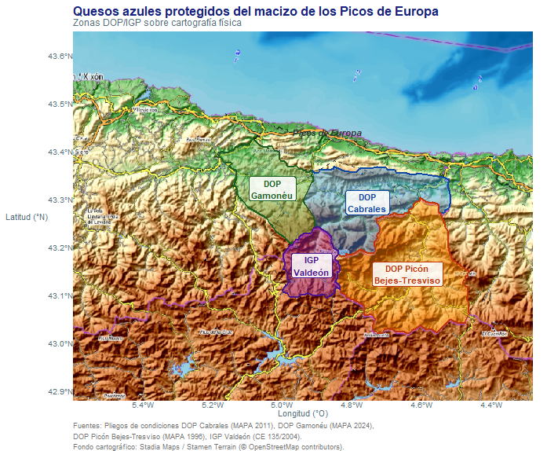
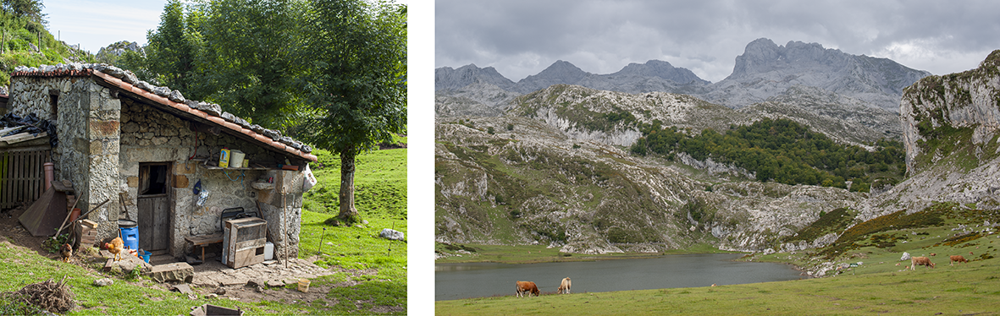
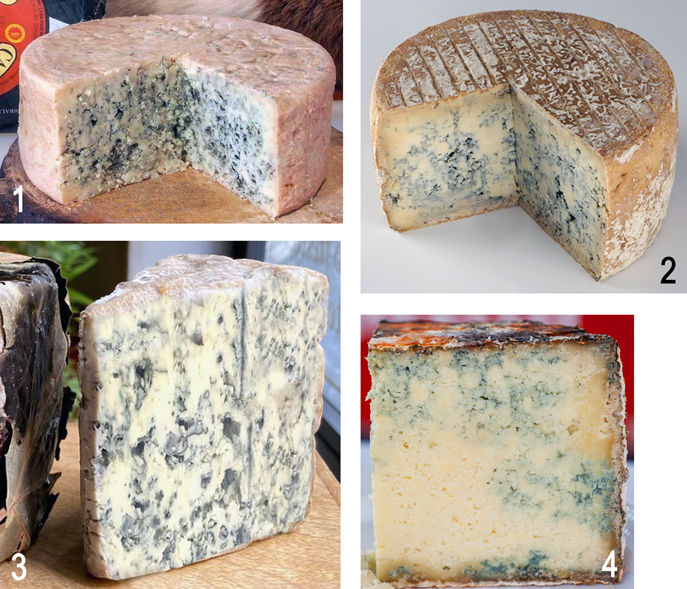
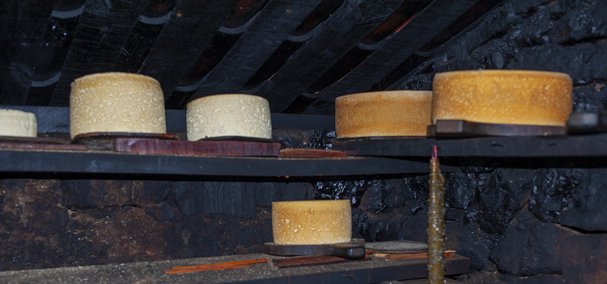
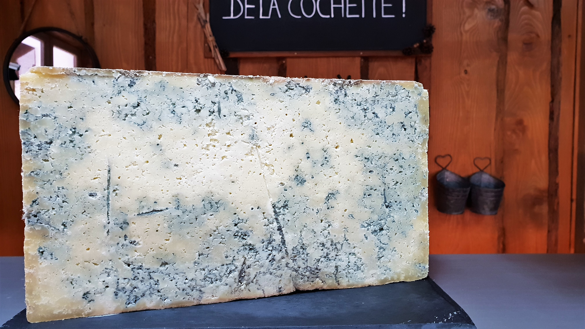
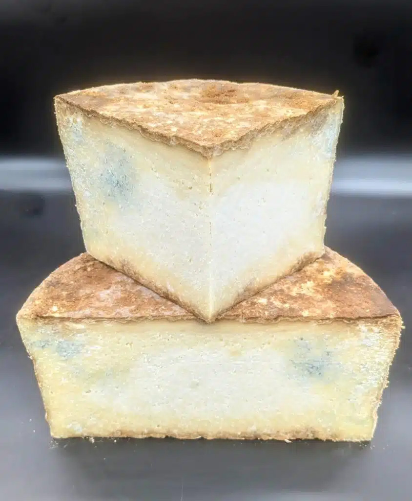
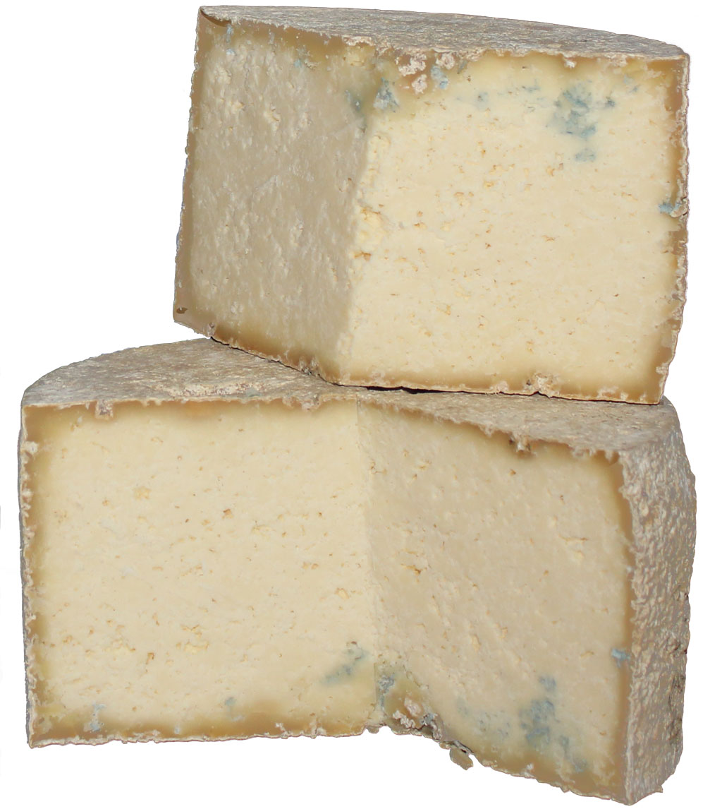
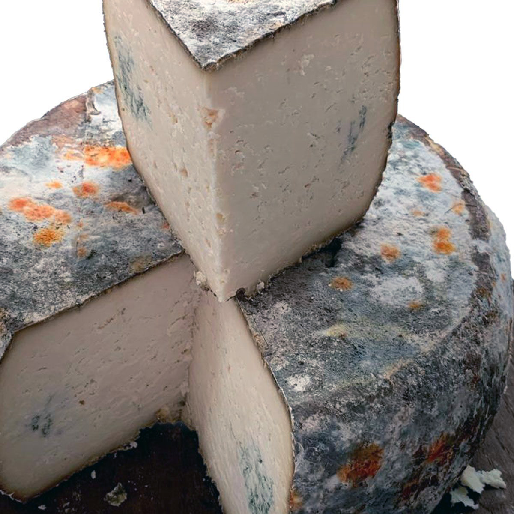
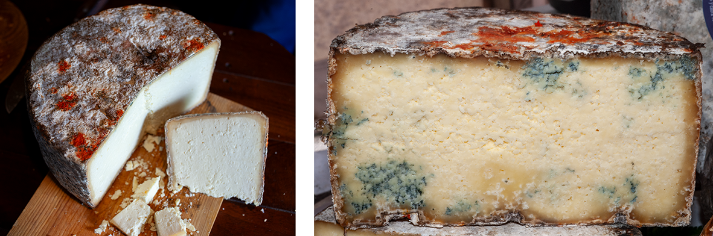

## Resumen {.unnumbered}

El queso Gamonéu (DOP), elaborado en los concejos asturianos de Cangas de Onís y Onís, se define en su pliego de condiciones como «**queso graso, madurado**, de corteza natural, elaborado con leche cruda de vaca, oveja y cabra, o con mezclas de dos o de los tres tipos de leche indicados, **ligeramente ahumado** y con **leves afloraciones verde-azuladas de Penicillium cerca de los bordes**»[^1].

Este artículo argumenta que dicha clasificación es tecnológicamente incorrecta y culturalmente empobrecedora: el Gamonéu **es un queso azul** con la particularidad añadida del ahumado, no un queso ahumado que puede presentar afloraciones de *Penicillium* de forma ocasional.

El argumento se desarrolla a través de cinco pilares convergentes: 

1. El sustrato geológico calizo compartido con el Cabrales, el Picón Bejes-Tresviso y el azul de Valdeón, que determina las condiciones microbiológicas de la zona; 
2. La hipótesis del origen común a partir de una práctica quesera ancestral de montaña en el macizo de los Picos de Europa; 
3. El papel original del ahumado como técnica de conservación pasiva —no como factor diferenciador deliberado— y su evolución moderna hacia el ahumado forzado en ahumaderos, con el efecto paradójico de dificultar la penetración del azul; 
4. El mecanismo bioquímico de la maduración en los quesos azules, en el que la proteólisis y la lipólisis son procesos internos conducidos por *P. roqueforti* en el interior de la pasta, no por el moho superficial de cueva; y 
5. El paralelo con el Bleu de Termignon (Alpes franceses), queso azul de contaminación espontánea sin inoculación, funcionalmente equivalente al Gamonéu. 

Se concluye que reconocer el azul como rasgo identitario del Gamonéu, en lugar de tolerarlo como defecto menor, no requiere ningún cambio en la tecnología de elaboración, y que la capa de brea generada por el ahumado excesivo es, irónicamente, un obstáculo real al desarrollo del azul que define al queso.

**Palabras clave:** Gamonéu, queso azul, *Penicillium roqueforti*, Picos de Europa, ahumado, maduración, proteólisis, lipólisis, Bleu de Termignon, DOP.

[^1]: En la definición de el queso Gamonéu he utilizado inicialmente la especificación
    del pliego de condiciones publicado en la web de su DOP y utilizada en la descripción
    del producto en ese mismo sitio web. Tras acabar este artículo, he encontrado que este
    pliego de condiciones tiene una actualización de enero de 2024, publicada por el
    Ministerio de Agricultura, Pesca y Alimentación, en la que la definición del queso se
    distancia aún más de la de queso azul:

    > Es un queso graso, madurado, de corteza natural, elaborado con leche cruda de vaca,
    > oveja o cabra, o con mezclas de los dos o de los tres tipos de leche indicados.

    La mención existente originalmente a las "leves afloraciones de azul", antes incluida
    en la definición del producto, se reduce ahora a unas notas al hablar del color de la 
    pasta, y redactado en una forma que casi parece indicar que estas afloraciones azules
    serían en todo caso ocasionales:

    > Color: en su interior, blanco o blanco-amarillento, pudiendo aparecer leves
    > afloraciones verde-azuladas en los bordes.

    mientras que se insiste en la predominancia del sabor ahumado:

    > Sabor: predominio suave de humo y un punto ligeramente picante. En boca evoluciona
    > mantecoso, con regusto persistente a frutos secos como la avellana.

    En las referencias incluyo ambas ediciones, que muestran la evolución del criterio de
    la DOP sobre el queso. La referencia principal es al texto original; dado que el nuevo
    texto se distancia aún más de la denominación propuesta de queso azul ahumado, el
    razonamiento utilizado en el artículo sigue siendo válido.
    
## Introducción

La denominación de origen protegida del queso Gamonéu, reconocida por la Unión Europea mediante el Reglamento (CE) 676/2008, describe el producto como «queso graso, madurado, de corteza natural, ligeramente ahumado, con leves afloraciones de *Penicillium* cerca de los bordes» [@dopgamoneu_pliego; @pliego_gamoneu_2024]. La formulación es reveladora por lo que omite: el azul no aparece en el nombre de la denominación, no preside la descripción del producto y queda reducido a un adjetivo menor («leves»). El resultado es que una fracción significativa de los consumidores, distribuidores e incluso técnicos no reconoce el Gamonéu como queso azul, cuando en realidad lo es desde cualquier perspectiva técnica coherente.

La pregunta no es trivial. La categorización de un queso determina sus mercados, su precio, su contexto de degustación y su relación con otros productos. Un Gamonéu comprendido como queso azul ahumado se sitúa naturalmente junto al Cabrales, el Picón Bejes-Tresviso y el azul de Valdeón —los otros grandes azules del macizo calizo de los Picos de Europa— como parte de una familia coherente con un origen geográfico y microbiológico común [@lopezdiaz_blue_cheese_2023]. Un Gamonéu comprendido como «queso ahumado que a veces tiene un poco de verde» queda huérfano de familia y privado de su identidad más profunda.

Este artículo construye el argumento con base histórica, geográfica, tecnológica y bioquímica, incorporando los nuevos elementos relativos al papel original del ahumado y al mecanismo interno de maduración de los quesos azules.

## Los azules de los Picos de Europa: una familia geográfica

### El sustrato geológico como determinante primario

Los Picos de Europa constituyen el mayor macizo kárstico de la Península Ibérica: una masa de caliza carbonífera de edad paleozoica, formada hace aproximadamente 300 millones de años en el fondo de un mar tropical y posteriormente plegada y elevada durante la orogenia hercínica y la alpina [@vera_geologia_iberica_2004]. La caliza no es solo el paisaje; es la condición estructural que hace posibles los quesos azules en esta zona. El karst genera cuevas naturales con temperatura constante de 8–12 °C y humedad relativa del 90–95 %: las mismas condiciones que se reproducen artificialmente en las cuevas de maduración del Roquefort en Combalou [@wolfe_cheese_rind_2014].

Este macizo no respeta fronteras administrativas. Las zonas de producción de los cuatro quesos azules protegidos del arco cantábrico —DOP Cabrales, DOP Gamonéu, DOP Picón Bejes-Tresviso y IGP Valdeón— se distribuyen sobre el mismo sustrato geológico, siguiendo los límites del afloramiento calizo:

- **DOP Cabrales**: concejos de Cabrales, Peñamellera Alta y Peñamellera Baja (Asturias) [@pliego_cabrales_2011].
- **DOP Gamonéu**: concejos de Cangas de Onís y Onís (Asturias) [@pliego_gamoneu_2024].
- **DOP Picón Bejes-Tresviso**: comarca de Liébana y municipio de Peñarrubia (Cantabria) [@pliego_picon_1996].
- **IGP Valdeón**: término municipal de Posada de Valdeón (León) [@pliego_valdeon_2004].

{#fig-mapa1}

{#fig-mapa2}

La distribución geográfica de la @fig-mapa1 no es una coincidencia histórica: es la expresión cartográfica de un único fenómeno geológico y microbiológico. En la @fig-mapa2 se ve claramente cómo las cuatro zonas de producción de queso se sitúan en los Picos de Europa. Las cuevas calizas de la zona favorecen especialmente el desarrollo del *Penicillium roqueforti* gracias a su temperatura y humedad naturalmente controladas.

### La hipótesis del origen común: un queso ancestral de montaña

La distribución actual de los azules del macizo calizo sugiere que todos ellos descienden de una misma práctica quesera ancestral de montaña. Antes de que existieran las denominaciones de origen, los pastores trashumantes de toda la cordillera realizaban la misma operación: en verano subían el ganado a los puertos altos, elaboraban queso en las cabañas con la leche disponible, y lo conservaban en las cuevas que encontraban a mano. El resultado inevitable en ese entorno —caliza, humedad, temperatura fresca, esporas de *Penicillium* presentes en el ambiente— era siempre un queso azul.

La producción de queso en el valle de Valdeón se remonta a la época prerromana, y cuando el ganado pastaba en las majadas de altura durante el verano, la leche se transformaba en queso en las propias cabañas. La misma descripción se aplica, sin cambiar una palabra, a las majadas de los puertos de Gamonéu, a las cabañas de Cabrales y a los pastores de Tresviso.

La diferenciación posterior entre Cabrales, Gamonéu, Picón y Valdeón es una construcción cultural, económica y administrativa, no una distinción tecnológica de fondo. El Cabrales evolucionó hacia la maximización deliberada del azul; el Gamonéu conservó el ahumado como técnica de conservación heredada y el azul quedó periférico —tanto físicamente en la pasta como simbólicamente en su identidad comercial— pero nunca desapareció, porque el entorno no lo permite. Como señalan López-Díaz et al. [-@lopezdiaz_blue_cheese_2023], los quesos azules tradicionales no se inoculaban con esporas de *P. roqueforti*: se contaminaban de forma natural a partir del entorno de elaboración y maduración, exactamente el mecanismo que opera en el Gamonéu.

## El ahumado: de conservante a signo de identidad 

### El origen del ahumado: proteger el queso durante el secado en las cabañas

El ahumado del Gamonéu no nació como un rasgo diferenciador deliberado. Nació de la necesidad más elemental: conservar el queso en las condiciones de una cabaña de pastor en los puertos de alta montaña durante el verano.

En las majadas de los Picos de Europa, los pastores cocinaban en el interior de las cabañas de piedra sobre fuego de leña —haya, brezo, enebro— sin chimenea o con tiro rudimentario. Los quesos recién elaborados se colocaban en las partes altas de la cabaña, en las tablas denominadas *talameras*, donde el humo era más denso, por una razón práctica: el humo mantenía alejadas las moscas, evitaba que los dípteros depositaran larvas en la corteza húmeda del queso fresco y creaba un ambiente poco propicio para las bacterias de putrefacción superficial. Era, en esencia, una técnica de conservación de supervivencia, no un proceso quesero planificado.

Esta forma de ahumado pasivo —que podríamos llamar ahumado ambiental o ahumado residual— impregnaba levemente la corteza sin crear una barrera impermeable. El queso absorbía los compuestos fenólicos del humo (guaiacol, siringol, eugenol) que le conferían ese aroma suave característico, y la corteza se endurecía ligeramente, pero el interior permanecía permeable al intercambio gaseoso, inicialmente con la cabaña y luego con la cueva.

### El ahumadero moderno y sus consecuencias no deseadas

Con la profesionalización de la producción quesera y la necesidad de diferenciarse en el mercado, los productores de Gamonéu construyeron ahumaderos específicos. La intención era positiva: estandarizar el proceso, garantizar el nivel de ahumado y hacer del humo un rasgo diferenciador reproducible. Sin embargo, este proceso tuvo consecuencias técnicas no previstas.

En el ahumado intensivo en ahumadero, los compuestos fenólicos del humo forman sobre la corteza una capa densa —coloquialmente llamada «brea»— que actúa como barrera física y química. Esta capa:

1. **Reduce la permeabilidad de la corteza** al intercambio gaseoso, dificultando la entrada del oxígeno necesario para el crecimiento de *P. roqueforti* desde el exterior [@junta_andalucia_pasta_azul_2020].
2. **Inhibe el crecimiento de mohos superficiales** por sus propiedades antimicrobianas, lo que reduce la contaminación externa de *Penicillium* durante la maduración en cueva.
3. **Dificulta la penetración** del azul desde los bordes hacia el interior, que es precisamente el mecanismo natural del Gamonéu.

El resultado paradójico es que cuanto más se ahúma el Gamonéu en ahumadero —buscando intensificar un rasgo diferenciador— más se obstaculiza el desarrollo del azul que lo define como queso de los Picos de Europa. El ahumado excesivo produce un queso con corteza más llamativa pero con menos azul interior: una inversión del orden natural de prioridades.

Conviene subrayar, no obstante, que la capa de brea **no impide** el desarrollo del azul: simplemente lo ralentiza y lo restringe a la zona periférica. El *Penicillium* presente en las cuevas de maduración penetra por las grietas naturales de la corteza, por los pequeños orificios que crea el propio proceso de contracción-expansión del queso, y a través de las zonas donde el ahumado no fue uniforme. De ahí que el pliego describa «afloraciones cerca de los bordes»: es exactamente donde la corteza es más permeable.

## El mecanismo bioquímico de la maduración: el moho interno es lo que importa

Este es quizás el aspecto menos comprendido en la discusión pública sobre el Gamonéu, y el más relevante desde el punto de vista técnico.

### La distinción fundamental: moho superficial vs. moho interno

En la cueva de maduración, la superficie de cualquier queso —Gamonéu, Cabrales, Picón o cualquier otro— se cubre de flora fúngica diversa: *Penicillium* de múltiples especies, *Mucor*, *Geotrichum candidum*, *Cladosporium* y levaduras. Esta flora superficial es visualmente impresionante —convierte la corteza en un paisaje de colores rojizos, verdosos y azulados— y es ecológicamente relevante porque crea el microentorno de la cueva.

Sin embargo, **el moho superficial no transforma la masa del queso de manera significativa**. Su acción enzimática se limita a la corteza y a una zona muy superficial de la pasta. No es el responsable del aroma, la textura ni el sabor característicos del queso azul.

La maduración real —la que transforma la pasta blanca y compacta en el queso de textura, sabor complejo y aroma que conocemos— es el resultado de la actividad de *P. roqueforti* **en el interior** de la pasta. Esta distinción es crítica y está bien establecida en la literatura científica [@flórez_blue_cheese_2017; @lopezdiaz_blue_cheese_2023]. Los datos cuantitativos son elocuentes: el Gamonéu presenta al final de su maduración unos 75.685 mg/kg de ácidos grasos libres (FFA), el valor más alto entre los azules españoles estudiados —superior al Picón Bejes-Tresviso (58.355 mg/kg) y al Valdeón (42.500 mg/kg)— [@gonzalez_llano_gamonedo_1992; @lopezdiaz_blue_cheese_2023]. Una lipólisis de esa magnitud solo puede ser producida por *P. roqueforti* activo en el interior de la pasta, no por el moho superficial de la corteza.

### Proteólisis y lipólisis: los procesos bioquímicos internos

La proteólisis es el proceso bioquímico primario más complejo e importante que interviene en los quesos de vetas azules durante la maduración, siendo considerado *P. roqueforti* el principal agente proteolítico. La lipólisis también es fuerte y origina, entre otros compuestos, las cetonas, que son los principales compuestos aromáticos de los quesos de vetas azules.

En términos más precisos:

**Proteólisis**: Las proteasas de *P. roqueforti* degradan la caseína —proteína mayoritaria de la leche— en péptidos y aminoácidos libres. Este proceso es responsable del ablandamiento progresivo de la pasta, que pasa de firme y friable a cremosa, y contribuye decisivamente al sabor. La proteólisis reduce además la dureza mecánica del queso, creando una textura más abierta que facilita la difusión de oxígeno hacia el interior y retroalimenta el propio crecimiento del moho [@lopezdiaz_blue_cheese_2023; @junta_andalucia_pasta_azul_2020].

**Lipólisis**: Las lipasas de *P. roqueforti* hidrolizan los triglicéridos de la leche liberando ácidos grasos de cadena corta y media. El ácido linolénico es precursor de las metilcetonas —2-pentanona, 2-heptanona y 2-nonanona— que son los compuestos responsables del sabor y el aroma característico del queso azul, generados por la enzima β-cetoacildescarboxilasa que oxida parcialmente los ácidos grasos libres.

### Las condiciones necesarias para la maduración interna

Para que *P. roqueforti* realice su función en el interior de la pasta, necesita cinco condiciones simultáneas [@junta_andalucia_pasta_azul_2020]:

1. **Oxígeno**: El *Penicillium* es aerobio estricto. Necesita acceso al oxígeno para crecer y producir las enzimas proteolíticas y lipolíticas. En los azules industriales esto se garantiza mediante perforación sistemática con agujas, lo que a veces ha llevado a los consumidores a hablar de "quesos *inyectados*", en la creencia de que el hongo ha sido introducido en el queso mediante una *inyección*. En el Gamonéu, el oxígeno penetra a través de las grietas naturales de la corteza y los ojos irregulares de la pasta.

2. **Temperatura**: El crecimiento óptimo de *P. roqueforti* se produce entre 8 y 12 °C, exactamente las condiciones de las cuevas calizas de los Picos de Europa. A temperaturas más altas el crecimiento es más rápido pero la producción enzimática es menos equilibrada.

3. **Actividad de agua y salinidad**: *P. roqueforti* es tolerante a la sal (hasta un 6 % de NaCl), lo que le confiere una ventaja competitiva sobre otros microorganismos que serían inhibidos por la salinidad del queso.

4. **pH**: El pH del Gamonéu —condicionado por la coagulación ácido-láctica y la actividad de las bacterias lácticas— debe estar en un rango compatible con el crecimiento fúngico. El incremento de pH por el catabolismo de aminoácidos durante la proteólisis es parte del proceso de retroalimentación positiva que mantiene las condiciones óptimas.

5. **Humedad relativa**: *P. roqueforti* requiere una humedad relativa elevada, en torno al 90–95 %, para desarrollarse en el interior de la pasta. La humedad cumple dos funciones simultáneas: mantiene la actividad de agua de la masa del queso en un rango compatible con el crecimiento fúngico ($a_w > 0,92$) y evita la desecación de la corteza, que de otro modo formaría una barrera física impermeable que bloquearía el intercambio gaseoso.

Las cuevas demasiado secas plantean un riesgo específico para el Gamonéu: cuando la humedad relativa cae por debajo del 80 %, la corteza se endurece y se agrieta de forma irregular, lo que paradójicamente puede favorecer entradas puntuales de aire pero inhibe el crecimiento uniforme del moho al reducir su actividad enzimática. Además, aumenta el riesgo de que el queso pueda ser atacado por ácaros que se refugian en estas grietas. El resultado es un azul distribuido de forma errática, concentrado en las grietas y ausente en el resto de la pasta. Este efecto se suma al ya descrito de la capa de brea del ahumado: un Gamonéu elaborado en una cueva seca y ahumado en exceso acumula dos obstáculos independientes al desarrollo del azul, lo que explica en parte la alta variabilidad que se observa entre productores y entre temporadas en la intensidad del veteado azul.

### Implicaciones para el Gamonéu

La consecuencia directa de este mecanismo es que **la presencia o ausencia de moho visible en la corteza no predice ni determina la calidad de la maduración interna**. Un Gamonéu con corteza intensamente ahumada —que inhibe el moho superficial— puede tener exactamente la misma actividad proteolítica y lipolítica interna que uno con corteza menos tratada, siempre que el *P. roqueforti* haya penetrado en el interior antes del ahumado o a través de las grietas de la corteza, y haya tenido las condiciones adecuadas para desarrollarse.

Recíprocamente, un queso con corteza muy enmohecida en cueva no tiene por eso una pasta mejor madurada: la acción del moho superficial es esencialmente cosmética desde el punto de vista de la calidad de la pasta.

## El paralelo con el Bleu de Termignon

El Bleu de Termignon es un queso azul de producción estacional elaborado en los Alpes franceses, en el Parque Nacional de Vanoise, a 1.300 metros de altitud. Es un queso de gran calidad, elaborado con leche de vacas que pastan a gran altura, donde hay que buscar la fuente del moho: éste pasa a la leche y todo el queso queda impregnado de un delicado sabor. El moho azul es natural y no sembrado, como en casi todos los azules restantes. Se desarrolla y expande con lentitud y poca uniformidad. Este queso es el único azul entre los quesos franceses que no se puede sembrar.

El paralelo con el Gamonéu es punto por punto:

| Característica | Bleu de Termignon | Gamonéu |
|---|---|---|
| Origen del *Penicillium* | Espontáneo, ambiental | Espontáneo, ambiental |
| Inoculación deliberada | No | No |
| Perforación de la pasta | No sistemática | No |
| Distribución del azul | Periférica, irregular | Periférica, cerca de los bordes |
| Leche | Cruda, de alta montaña | Cruda, de alta montaña en el caso del *Gamonéu del puertu* |
| Especie | Vaca | Vaca, cabra, oveja y sus mezclas |
| Altitud de producción | 1.300 m (estacional) | Hasta 1.500 m (Puerto, estacional) |
| Clasificación oficial | Queso azul | Queso ahumado con afloraciones |

Las únicas diferencias sustanciales están en la composición de la leche y en que el Termignon no se ahúma y el Gamonéu sí. Pero esa diferencia no afecta a la naturaleza del azul: afecta a su distribución y a su intensidad visual. El Termignon es universalmente reconocido como queso azul. El Gamonéu debería tener el mismo reconocimiento.

La variedad de *Penicillium* empleada para fermentar el Termignon es una tercera variante domesticada que podría introducir variedad genética en las futuras cepas empleadas en los quesos azules, lo que es relevante para la biodiversidad microbiana del sector. La misma observación aplica a las cepas salvajes de *P. roqueforti* del entorno de los Picos de Europa, que no han sido sometidas a selección artificial y representan un patrimonio microbiológico singular. Por esta razón deben tratarse con sumo cuidado las experiencias de aislamiento de cepas naturales para su replicación industrial en laboratorios biotecnológicos externos; en el momento en el que estos microorganismos se producen de manera industrial, dejan precisamente de ser cepas salvajes naturales y reducen su biodiversidad.

::: {#fig-termignon layout-ncol=2}

{#fig-termignon1}

{#fig-termignon2 height=6cm}

Queso Bleu de Termignon
:::

::: {#fig-gamoneu layout-ncol=3}

{#fig-gamoneu1 height=6cm}

{#fig-gamoneu2 height=6cm}

{#fig-gamoneu2 height=6cm}

Queso Gamonéu
:::

## El error del pliego y su corrección implícita

El pliego de condiciones de la DOP Gamonéu describe las afloraciones de *Penicillium* como rasgo secundario con el adjetivo «leves». Esta formulación tuvo probablemente una motivación comercial defensiva: los redactores del pliego temían que piezas con desarrollo azul abundante fueran rechazadas por el mercado de consumidores no habituados, o confundidas con Cabrales de segunda categoría.

El resultado, sin embargo, fue un texto que describe el azul como algo que «se acepta» en lugar de algo que «se busca». Esta distinción semántica ha tenido consecuencias prácticas: algunos productores perciben el azul desarrollado como un defecto de control de calidad, cuando es exactamente lo contrario. De hecho, los quesos de Gamoneu más apreciados tradicionalmente eran los que presentaban *cardenillo*, palabra del vocabulario tradicional para referirse a las vetas azules de  *Penicillium*.

El propio sitio web de la DOP describe que «la acción de los hongos y las levaduras sobre el queso Gamonéu proporciona a éste su aroma y sabor definitivos» —una formulación que reconoce implícitamente que sin el *Penicillium* no hay Gamonéu. La contradicción entre este reconocimiento implícito y la formulación restrictiva del pliego es el núcleo del problema que señala este artículo.

A esta contradicción normativa se suma en los últimos años una presión de mercado que actúa en sentido contrario al desarrollo del azul: una fracción creciente de consumidores, especialmente en canales de distribución urbanos y en el segmento de regalo, demanda quesos de Gamonéu con pasta muy blanca y corteza muy florida, percibiendo el veteado azul intenso como señal de exceso de maduración o incluso de deterioro. Esta preferencia, documentada por los propios productores, genera un incentivo económico directo para acortar el período de maduración y sacar el queso antes de que *P. roqueforti* haya transformado significativamente la pasta. El resultado es un círculo vicioso: el mercado premia el queso menos maduro, el productor adapta su proceso para satisfacer esa demanda, y el queso resultante confirma en el consumidor la idea de que el Gamonéu es un queso blanco con algo de verde en los bordes.

Esta deriva es especialmente problemática desde el punto de vista de la protección de origen. Una denominación de origen no tiene como único objeto garantizar la procedencia geográfica del producto: su razón de ser más profunda es preservar el vínculo entre el territorio, las prácticas tradicionales y las características organolépticas que definen el producto auténtico. Estos factores conforman lo que se conoce como *terroir*: la combinación de la caliza kárstica de los Picos de Europa, las cuevas con su temperatura y humedad específicas y su microbiota fúngica particular, la leche de los pastos de alta montaña, con los matices que introducen en ella las razas autóctonas de ganado, y la práctica ancestral del pastor que ahúma el queso en la cabaña. Todos esos elementos juntos producen algo que no puede replicarse en otro lugar ni con otra tecnología. Un Gamonéu elaborado con maduración insuficiente para satisfacer la demanda de quesos blancos no es simplemente un Gamonéu joven — es un producto que se aparta del tipo tradicional que la DOP tiene el deber de proteger. El queso que los pastores de los puertos de Cangas de Onís y Onís elaboraban y conservaban en las cuevas no era blanco: era exactamente el queso con cardenillo que hoy el mercado parece no premiar. Proteger la DOP Gamonéu exige, en consecuencia, proteger también el azul que la define, y no solo el nombre y la geografía.

## Conclusiones

El Gamonéu es un queso azul. Esta conclusión se sostiene sobre cinco argumentos convergentes:

**1. Geológico**: El macizo calizo de los Picos de Europa determina las condiciones microbiológicas que hacen inevitable el azul en cualquier queso elaborado y madurado en su entorno. El Gamonéu comparte sustrato geológico con el Cabrales, el Picón Bejes-Tresviso y el Valdeón.

**2. Histórico**: El ahumado original del Gamonéu no era un rasgo diferenciador deliberado sino una técnica de conservación pasiva —protección contra los insectos y contaminantes externos mediante el humo del fuego de cocina de la cabaña— que coexistía con el desarrollo natural del azul. La construcción de ahumaderos modernos fue una intervención posterior que, paradójicamente, dificulta el azul al crear una corteza impermeable, aunque no lo elimina.

**3. Tecnológico**: El Gamonéu es funcionalmente equivalente al Bleu de Termignon: un azul de contaminación ambiental espontánea, sin inoculación, en el que el *Penicillium* penetra por las grietas de la corteza y se desarrolla en el interior. La diferencia con el Cabrales es de grado —el Cabrales maximiza deliberadamente el azul mediante inoculación— no de naturaleza.

**4. Bioquímico**: La maduración del Gamonéu es producida por la actividad enzimática de *P. roqueforti* en el interior de la pasta: proteólisis que transforma la caseína en péptidos y aminoácidos, lipólisis que genera los ácidos grasos precursores de las metilcetonas responsables del aroma [@lopezdiaz_blue_cheese_2023; @gonzalez_llano_gamonedo_1992]. El moho superficial visible en la corteza de cueva no produce estas transformaciones de manera significativa. Un Gamonéu bien madurado lleva el trabajo del *Penicillium* en el interior de su pasta, aunque la corteza esté casi limpia.

**5. Normativo**: El propio pliego de condiciones describe afloraciones de *Penicillium* como rasgo definitorio del producto y reconoce que «la acción de los hongos y las levaduras proporciona al queso su aroma y sabor definitivos». La calificación de «leves» para las afloraciones es una descripción de una realidad —el azul es menos extenso que en el Cabrales— no una limitación de su papel como agente de maduración.

El desarrollo de azul en el queso Gamonéu debe ser considerado un factor de calidad: el buen desarrollo de *Penicillium* es esencial en los procesos de desarrollo de sabor y textura. Reconocer el Gamonéu como queso azul ahumado no requiere ningún cambio en la tecnología de elaboración, aunque sería recomendable un cambio en los pliegos de condiciones, sustituyendo «leves afloraciones verde-azuladas cerca de los bordes» por  «afloraciones verde-azuladas cerca de los bordes y en el interior, que habitualmente no sobrepasan el 50% de la masa del queso», evitando que los quesos con un desarrollo moderado de azul se vean penalizados. Requiere también un cambio en el orden de prioridades semánticas: decir que el Gamonéu es un azul que se ahúma, en lugar de un queso ahumado que a veces presenta azul. El queso sería exactamente el mismo. Su comprensión, y su lugar en el patrimonio quesero europeo, radicalmente distintos.

Por último, cabe señalar que el ahumado moderado —tal como se practicaba originalmente en las cabañas— no solo es compatible con el desarrollo del azul sino que crea un perfil sensorial único en el panorama de los quesos azules europeos: la combinación de notas ahumadas y de metilcetonas producidas por *P. roqueforti* genera una complejidad aromática que ningún otro queso del mundo replica. Proteger esa singularidad pasa, paradójicamente, por no forzar el ahumado hasta el punto de anular la bioquímica que la hace posible.

## Referencias {.unnumbered}

::: {#refs}
:::
